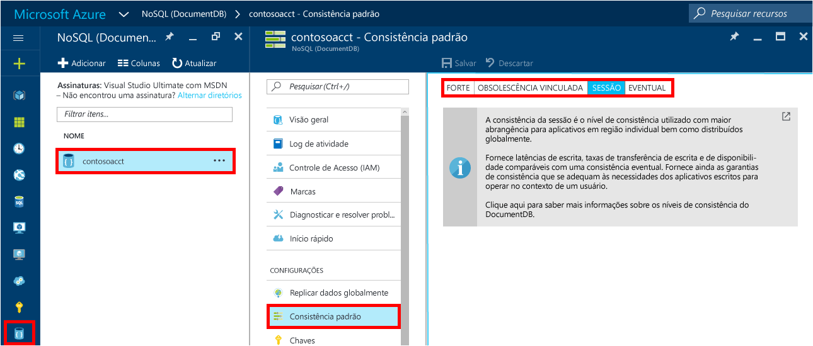

1. Em uma nova janela, entre no [portal do Azure](https://portal.azure.com/).
2. Na barra de navegação, clique em **Novo**, em **Bancos de Dados** e em **NoSQL (DocumentDB)**.
   
     
3. Na folha **Nova conta** , especifique a configuração desejada para a conta do DocumentDB.
   
    
   
   * No campo **ID** , digite um nome para identificar a conta do DocumentDB.  Quando a **ID** for validada, uma marca de seleção verde será exibida na caixa de **ID**. Esse valor de **ID** torna-se o nome de host no URI. A **ID** pode conter somente letras minúsculas, números e o caractere '-', e deve ter entre 3 e 50 caracteres. Observe que *documents.azure.com* é anexado ao nome do ponto de extremidade que você escolher, e seu resultado se torna o ponto de extremidade da sua conta do DocumentDB.
   * Na **API NoSQL**, selecione **DocumentDB**.  
   * Em **Assinatura**, selecione a assinatura do Azure que deseja usar para a conta do DocumentDB. Se a conta tiver apenas uma assinatura, ela será selecionada por padrão.
   * Em **Grupo de Recursos**, selecione ou crie um grupo de recursos para sua conta do DocumentDB.  Um novo grupo de recursos é criado por padrão. Para saber mais, confira [Usando o portal do Azure para gerenciar os recursos do Azure](../articles/azure-portal/resource-group-portal.md).
   * Use **Local** para especificar a localização geográfica na qual hospedar a conta do DocumentDB. 
4. Depois que as opções da nova conta do DocumentDB forem configuradas, clique em **Criar**. Para verificar o status da implantação, verifique o hub de Notificações.  
   
     
   
   
5. Depois que a conta do DocumentDB for criada, ela estará pronta para ser usada com as configurações padrão. Para revisar as configurações padrão, clique no ícone **NoSQL (DocumentDB)** na barra de navegação, clique em sua nova conta e clique em **Consistência padrão** no menu de recursos.

     

   A consistência padrão da conta do DocumentDB é definida como **Sessão**.  Você pode ajustar a consistência padrão selecionando uma das outras opções de consistência disponíveis. Para saber mais sobre os níveis de consistência oferecidos pelo DocumentDB, confira [Níveis de consistência no DocumentDB](../articles/documentdb/documentdb-consistency-levels.md).

[How to: Create a DocumentDB account]: #Howto
[Next steps]: #NextSteps
[documentdb-manage]:../articles/documentdb/documentdb-manage.md

<!--HONumber=Feb17_HO3-->

