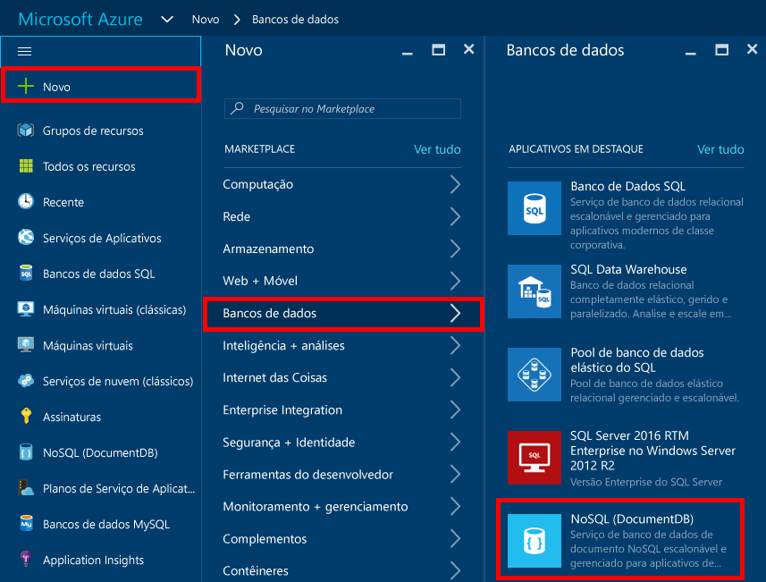
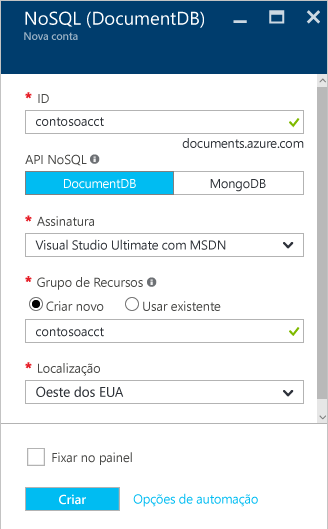
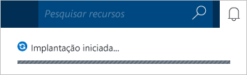
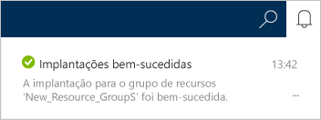

1.	Entre no [Portal do Azure](https://portal.azure.com/).
2.	Na barra de navegação, clique em **Novo**, em **Dados + Armazenamento** e em **Base de Dados de Documentos (NoSQL)**.

	

3. Na folha **Nova conta**, especifique a configuração desejada para a conta do Banco de Dados de Documentos.

	

	- No campo **ID**, digite um nome para identificar a conta do Banco de Dados de Documentos. Quando o **ID** for validado, uma marca de seleção verde será exibida na caixa de **ID**. Esse valor de **ID** torna-se o nome de host no URI. A **ID** pode conter somente letras minúsculas, números e o caractere “-”, e deve ter entre 3 e 50 caracteres. Observe que *documents.azure.com* é anexado ao nome do ponto de extremidade que você escolher, e seu resultado vai se tornar o ponto de extremidade da sua conta do Banco de Dados de Documentos.

	- Para **Assinatura**, selecione a assinatura do Azure que deseja usar para a conta do Banco de Dados de Documentos. Se a sua conta tiver apenas uma assinatura, essa conta será selecionada por padrão.

	- Em **Grupo de Recursos**, selecione ou crie um grupo de recursos para sua conta do Banco de Dados de Documentos. Por padrão, um novo grupo de recursos é criado. Para saber mais, veja [Como usar o portal do Azure para gerenciar os recursos do Azure](../articles/azure-portal/resource-group-portal.md).
	- Use **Local** para especificar a localização geográfica na qual hospedar a sua conta do Banco de Dados de Documentos.
	
	- Para fornecer acesso conveniente à sua conta e aos recursos que você criará no futuro, verifique **Fixar no painel**.

4.	Após as opções da nova conta do Banco de Dados de Documentos serem configuradas, clique em **Criar**. Para verificar o status da implantação, você pode monitorar o progresso no quadro inicial. 

	Ou então, você pode monitorar o progresso do hub de notificações.

	

	

5.	Após a conta do Banco de Dados de Documentos ser criada, ela estará pronta para uso com as configurações padrão. Observe que a consistência padrão da conta do Banco de Dados de Documentos será definida como **Sessão**. Você pode ajustar a consistência padrão clicando em **Consistência Padrão** no menu de recursos. Para saber mais sobre os níveis de consistência oferecidos pelo Banco de Dados de Documentos, confira [Níveis de consistência no Banco de Dados de Documentos](../articles/azure-portal/resource-group-portal.md).

    

    

[How to: Create a DocumentDB account]: #Howto
[Next steps]: #NextSteps
[documentdb-manage]: ../articles/documentdb/documentdb-manage.md

<!---HONumber=AcomDC_0831_2016-->