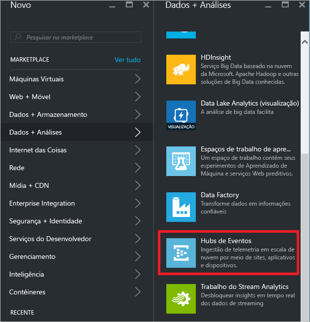
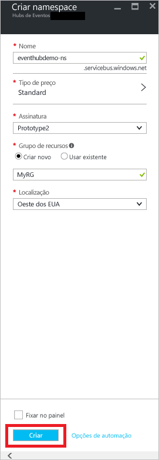
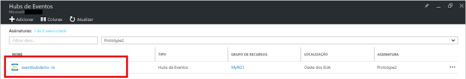
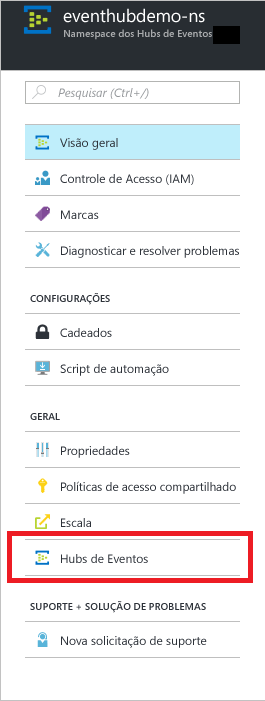
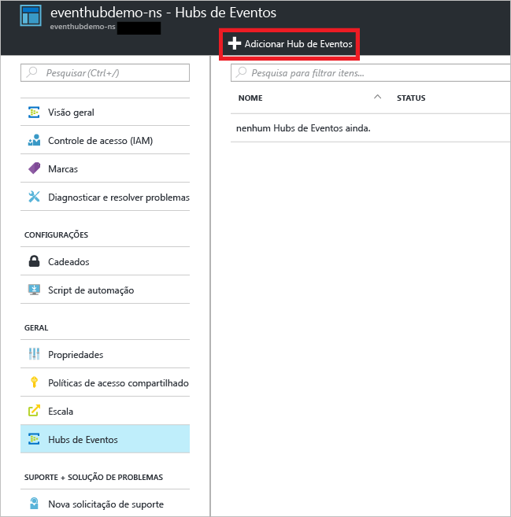
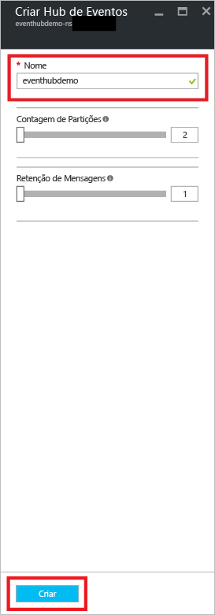
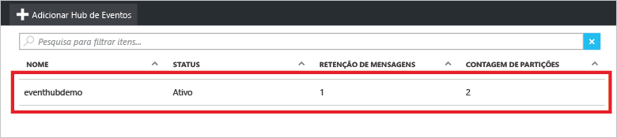
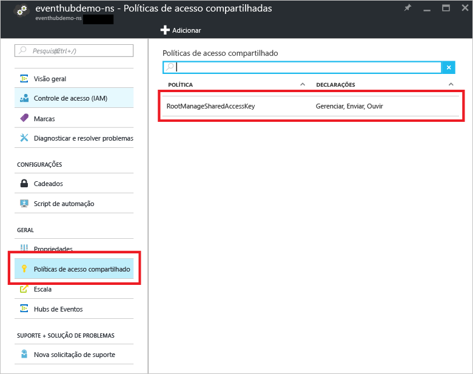
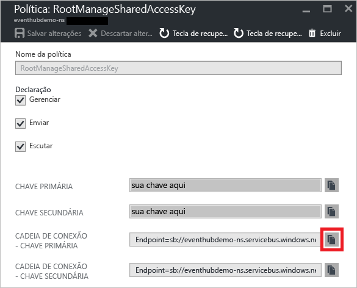

## Criar um Hub de Evento
1. Faça logon no [portal do Azure][portal do Azure] e clique em **Novo** na parte superior esquerda da tela.
2. Clique em **Internet das Coisas** e, em seguida, clique em **Hubs de Eventos**.
   
    
3. Na folha **Criar um namespace** , insira um nome de namespace. O sistema imediatamente verifica para ver se o nome está disponível.
   
    
4. Depois de verificar se o nome do namespace está disponível, escolha o tipo de preço (Básico ou Standard). Além disso, escolha uma assinatura do Azure, o grupo de recursos e o local no qual o recurso será criado. 
5. Clique em **Criar** para criar o namespace.
6. Na lista de namespaces do Hubs de Eventos, clique no namespace recém-criado.      
   
    
7. Na folha do namespace, clique em **Hubs de Eventos**.
   
    
8. Na parte superior da folha, clique em **Adicionar Hub de Eventos**.
   
    
9. Digite um nome para seu Hub de Eventos e clique em **Criar**.
   
    
10. Na lista de Hubs de Eventos, clique no nome do Hub de Eventos recém-criado. 
    
     
11. Novamente na folha do namespace (e não na folha do Hub de Eventos específico), clique em **Políticas de acesso compartilhado** e clique em **RootManageSharedAccessKey**.
    
     
12. Clique no botão de cópia para copiar a cadeia de conexão **RootManageSharedAccessKey** na área de transferência. Salve essa cadeia de conexão para usá-la posteriormente no tutorial.
    
     

Seu Hub de Evento foi criado, e você tem as cadeias de conexão que precisa para enviar e receber eventos.

[portal do Azure]: https://portal.azure.com/

<!--HONumber=Nov16_HO4-->

