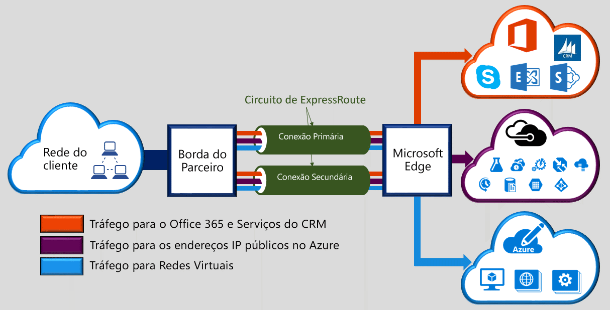

A Rota Expressa do Microsoft Azure permite que você estenda suas redes locais até a nuvem da Microsoft por meio de uma conexão privada dedicada, facilitada por um provedor de conectividade. Com a Rota Expressa, você pode estabelecer conexões com os serviços de nuvem da Microsoft, como o Microsoft Azure, o Office 365 e o CRM Online. A conectividade pode ocorrer de uma rede “qualquer para qualquer” (VPN IP), uma rede Ethernet ponto a ponto ou uma conexão cruzada virtual por meio de um provedor de conectividade em uma colocalização. As conexões da Rota Expressa não passam pela Internet pública. Isso permite que as conexões da Rota Expressa ofereçam mais confiabilidade, mais velocidade, latências menores e muito mais segurança do que as conexões típicas pela Internet.  

