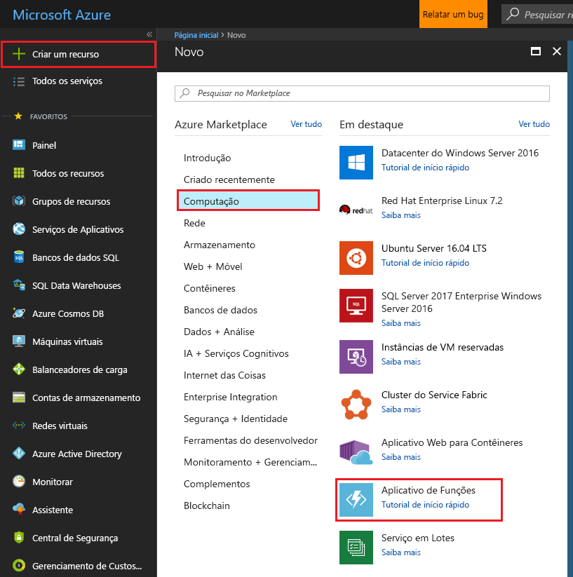
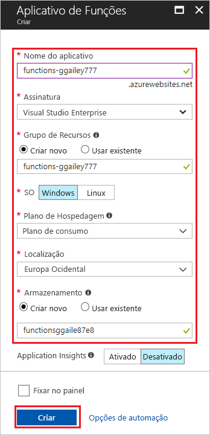

1. Clique no botão **Novo** encontrado à esquerda superior do Portal do Azure, e selecione **Computação** > **Aplicativo de funções**. 

    

2. Use as configurações do aplicativo de funções especificadas na tabela abaixo da imagem.

    

    | Configuração      | Valor sugerido  | Descrição                                        |
    | ------------ |  ------- | -------------------------------------------------- |
    | **Nome do aplicativo** | Nome globalmente exclusivo | Nome que identifica seu novo aplicativo de funções. Os caracteres válidos são `a-z`, `0-9` e `-`.  | 
    | **Assinatura** | Sua assinatura | A assinatura sob a qual este novo aplicativo de funções será criado. | 
    | **[Grupo de Recursos](../articles/azure-resource-manager/resource-group-overview.md)** |  myResourceGroup | Nome do novo grupo de recursos no qual criar o seu aplicativo de funções. | 
    | **SO** | Windows | A hospedagem sem servidor no momento só está disponível quando executada no Windows. Para a hospedagem Linux, consulte [Criar sua primeira função em execução no Linux usando a CLI do Azure](../articles/azure-functions/functions-create-first-azure-function-azure-cli-linux.md). |
    | **[Plano de hospedagem](../articles/azure-functions/functions-scale.md)** |   Plano de consumo | Plano de hospedagem que define como os recursos são alocados para seu aplicativo de funções. No **Plano de Consumo** padrão, os recursos são adicionados dinamicamente conforme exigido por suas funções. Nesta hospedagem [sem servidor](https://azure.microsoft.com/overview/serverless-computing/), você só paga pelo tempo durante o qual suas funções são executadas.   |
    | **Localidade** | Europa Ocidental | Escolha uma localização perto de você ou perto de outros serviços que suas funções acessarão. |
    | **[Conta de armazenamento](../articles/storage/common/storage-create-storage-account.md#create-a-storage-account)** |  Nome globalmente exclusivo |  Nome da nova conta de armazenamento usada pelo seu aplicativo de funções. Os nomes da conta de armazenamento devem ter entre 3 e 24 caracteres e podem conter apenas números e letras minúsculas. Você também pode usar uma conta existente. |

1. Clique em **Criar** para provisionar e implantar o novo aplicativo de funções.
