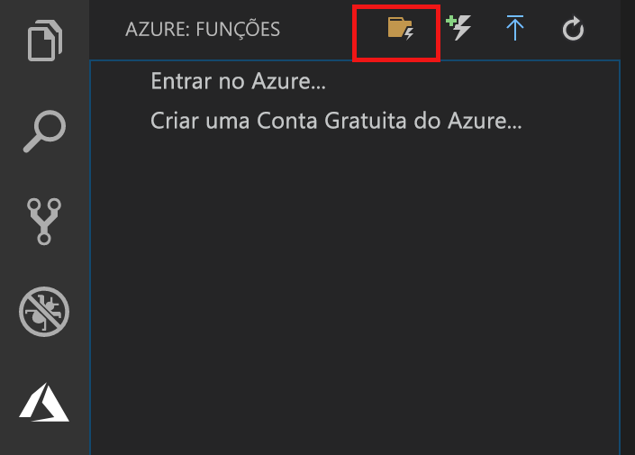
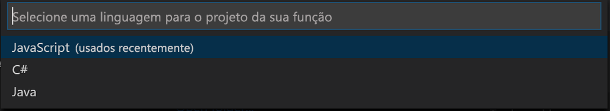

## Criar um projeto do Azure Functions

O modelo de projeto do Azure Functions no Visual Studio Code cria um projeto que pode ser publicado em um aplicativo de funções no Azure. Um aplicativo de funções permite a você agrupar funções como uma unidade lógica para o gerenciamento, implantação e compartilhamento de recursos.

1. No Visual Studio Code, selecione o logotipo do Azure para exibir a área **Azure: Functions** área e, em seguida, selecione o ícone Criar Novo Projeto.

    

1. Escolha um local para seu workspace do projeto e escolha **Selecionar**.

    > [!NOTE]
    > Este artigo foi projetado para ser concluídas fora de um workspace. Nesse caso, não selecione uma pasta de projeto que faz parte de um workspace.

1. Selecione a linguagem de programação para o seu projeto de aplicativo de função. Neste artigo, o JavaScript é usado.
    

1. Quando solicitado, escolha **Adicionar ao workspace**.

O Visual Studio Code cria o projeto de aplicativo de função em um novo workspace. Este projeto contém os arquivos de configuração [host.json](../articles/azure-functions/functions-host-json.md) e [local.settings.json](../articles/azure-functions/functions-run-local.md#local-settings-file), além de quaisquer arquivos de projeto específicos a uma linguagem. Você também obtém um novo repositório Git na pasta do projeto.