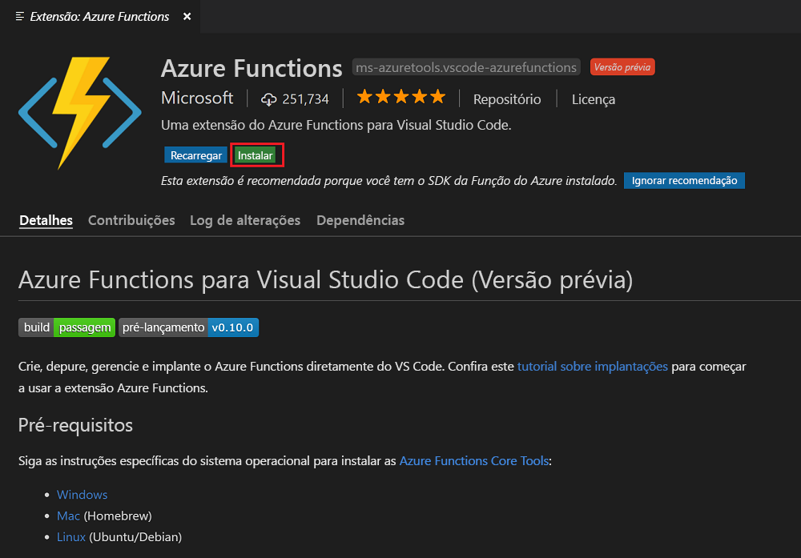
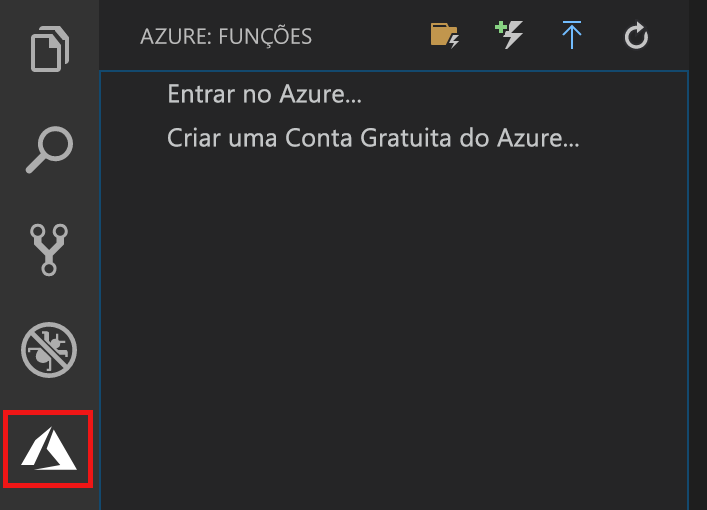

## Instalar a extensão Azure Functions

A extensão Azure Functions é usada para criar, testar e implantar funções no Azure.

1. No Visual Studio Code, abra **Extensões** e pesquise por `azure functions`, ou [abra este link no Visual Studio Code](vscode:extension/ms-azuretools.vscode-azurefunctions).

1. Selecione **Instalar** para instalar a extensão no Visual Studio Code.

    

1. Reinicie o Visual Studio Code e selecione o ícone do Azure na barra Atividade. Você deve ver uma área do Azure Functions na barra lateral.

    