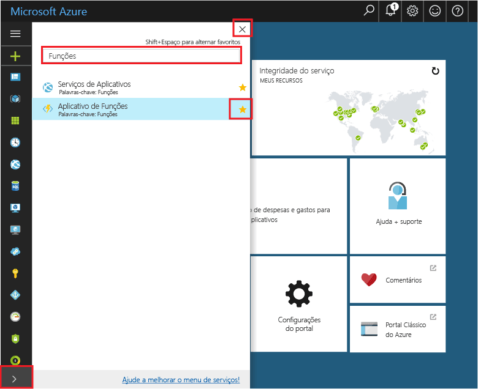

## Adicionar Aplicativos de Funções aos seus favoritos do portal 

Se você ainda não fez isso, adicione Aplicativos de Funções aos seus favoritos no Portal do Azure. Isso torna mais fácil localizar seus aplicativos de funções. Se você já tiver feito isso, vá para a próxima seção. 

1. Faça logon no [Portal do Azure](https://portal.azure.com/).

2. Clique na seta no canto inferior esquerdo para expandir todos os serviços, digite `Functions` no campo **Filtro** e, em seguida, clique na estrela ao lado de **Aplicativos de Funções**.  
 
    

    Isso adiciona o ícone do Functions ao menu à esquerda do portal.

3. Feche o menu e role para baixo até a parte inferior para ver o ícone do Functions. Clique nesse ícone para ver uma lista de todos os seus aplicativos de funções. Clique em seu aplicativo de funções para trabalhar com funções neste aplicativo. 
 
    
 
     