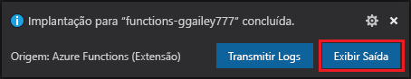
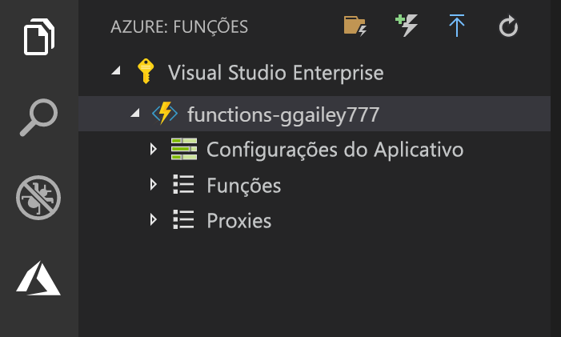

## Publicar o projeto no Azure

O Visual Studio Code permite que você publique seu projeto de funções diretamente no Azure. No processo, você criará um aplicativo de funções e recursos relacionados em sua assinatura do Azure. O aplicativo de funções fornece um contexto de execução para suas funções. O projeto é empacotado e implantado para o novo aplicativo de função em sua assinatura do Azure. 

Este artigo pressupõe que você está criando um novo aplicativo de funções. Publicar em um aplicativo de funções existente substitui o conteúdo desse aplicativo no Azure.

1. Na área **Azure: Functions**, selecione o ícone Implantar no aplicativo de funções.

    

1. Escolha a pasta de projeto, que é o seu workspace atual.

1. Se você tiver mais de uma assinatura, escolha aquela que você deseja para hospedar seu aplicativo de funções e, em seguida, escolha **+ Criar novo aplicativo de funções**.

1. Digite um nome globalmente exclusivo que identifica seu aplicativo de funções e pressione Enter. Caracteres válidos para um nome de aplicativo de funções são `a-z`, `0-9` e `-`.

1. Escolha **+ Criar novo grupo de recursos**, digite um nome de grupo de recursos, tal como `myResourceGroup`, e pressione enter. Também é possível usar um grupo de recursos existente.

1. Escolha **+ Criar nova conta de armazenamento**, digite um nome globalmente exclusivo da nova conta de armazenamento usada pelo aplicativo de funções e pressione Enter. Os nomes da conta de armazenamento devem ter entre 3 e 24 caracteres e podem conter apenas números e letras minúsculas. Você também pode usar uma conta existente.

1. Escolha um local em uma [região](https://azure.microsoft.com/regions/) perto de você ou perto de outros serviços acessados pelas suas funções.

    A criação do aplicativo de funções começa após você escolher o local. Uma notificação é exibida depois que seu aplicativo de funções é criado e o pacote de implantação é aplicado.

1. Selecione **Exibir saída** nas notificações para exibir a criação e os resultados da implantação, incluindo os recursos do Azure que você criou.

    

1. Anote a URL do novo aplicativo de funções no Azure. Você pode usar isso para testar sua função depois que o projeto é publicado no Azure.

    

1. De volta na área **Azure: Functions**, você verá o novo aplicativo de funções exibido em sua assinatura. Quando você expandir este nó, você verá as funções no aplicativo de funções, bem como configurações de aplicativo e proxies de função.

    

    No nó do aplicativo de funções, digite Ctrl e clique (com o botão direito do mouse) para escolher executar várias tarefas de gerenciamento e de configuração do aplicativo de funções no Azure. Você também pode optar por exibir o aplicativo de funções no portal do Azure.
