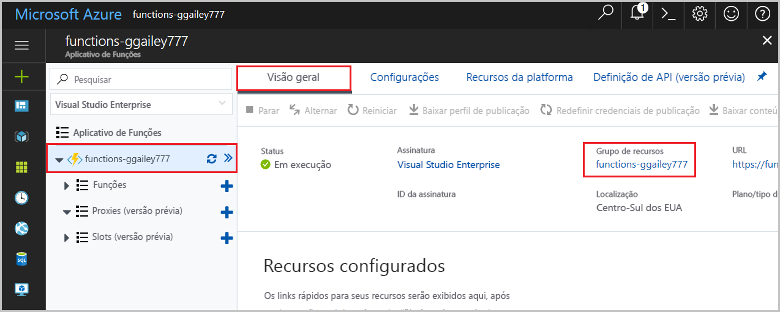

Outros inícios rápidos nessa coleção aproveitam esse início rápido. Se você planeja continuar trabalhando com inícios rápidos subsequentes ou com os tutoriais, não limpe os recursos criados nesse início rápido. 

Se você não planeja continuar, clique no **grupo de recursos** para o aplicativo de funções no portal e clique em **Excluir**. 

