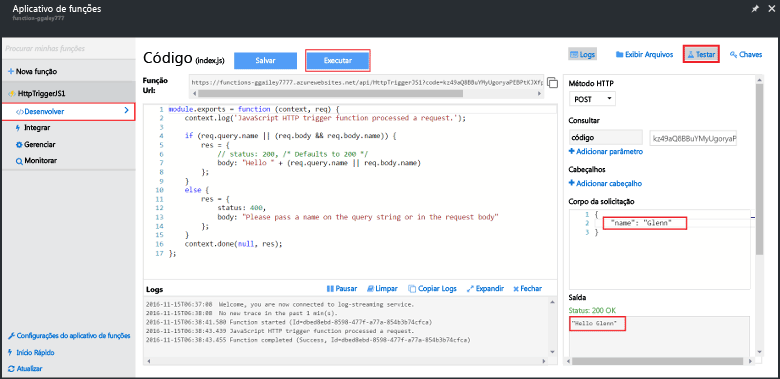

Como os inícios rápidos do Azure Functions contêm código funcional, você poderá testar imediatamente sua nova função.

1. Na guia **Desenvolver**, examine a janela **Código** e observe que o código fornecido espera uma solicitação HTTP com um valor *name* passado no corpo da mensagem ou em uma cadeia de consulta. Quando a função é executada, esse valor é retornado na mensagem de resposta. O exemplo abaixo é uma função JavaScript.
   
2. Clique em **Testar** para exibir o painel de solicitação de teste HTTP interno para a função.
 
    

3. Na caixa de texto **Corpo da solicitação**, altere o valor da propriedade *name* para seu nome e clique em **Executar**. Veja que a execução é disparada por uma solicitação HTTP de teste, as informações são gravadas em logs e a resposta "hello..." é exibida na **Saída**. 

4. Para disparar a execução da mesma função de uma ferramenta de teste de HTTP ou de outra janela de navegador, copie o valor de **URL da Função** da guia **Desenvolver** e cole-o na ferramenta ou na barra de endereços do navegador. Acrescente o valor de cadeia de caracteres de consulta `&name=yourname` à URL e execute a solicitação. Observe que as mesmas informações são gravadas os logs e a mesma cadeia de caracteres está contida no corpo da mensagem de resposta.

    
