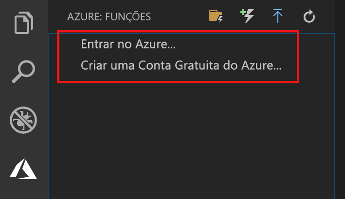

## Entrar no Azure

Antes de poder publicar seu aplicativo, você precisa entrar no Azure.

1. Na área **Azure: Functions**, escolha **Entrar no Azure…**. Se você não tiver uma, poderá **Criar uma conta gratuita do Azure**.

    

1. Quando solicitado, selecione **Copiar e abrir**, ou copie o código exibido e abra <https://aka.ms/devicelogin> no seu navegador.

1. Cole o código copiado na página **Logon do dispositivo**, verifique a entrada para o Visual Studio Code e selecione **Continuar**.  

1. Conclua a entrada usando as credenciais da conta do Azure. Depois de entrar com sucesso, você pode fechar o navegador.
