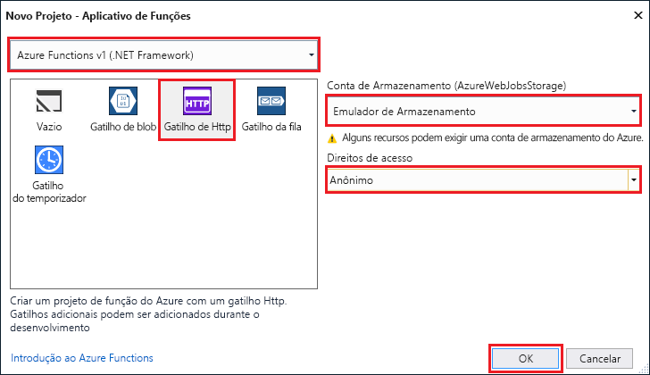

O modelo de projeto do Azure Functions no Visual Studio cria um projeto que pode ser publicado em um aplicativo de funções no Azure. Um aplicativo de funções permite a você agrupar funções como uma unidade lógica para o gerenciamento, implantação e compartilhamento de recursos.

1. No Visual Studio, selecione **Novo** > **Projeto** no menu **Arquivo**.

2. No diálogo **Novo Projeto**, selecione **Instalado**, expanda **Visual C#** > **Cloud**, selecione **Azure Functions**, digite um **Nome** para seu projeto e clique em **OK**. O nome do aplicativo de funções deve ser válido como um namespace do C# e, portanto, não use outros caracteres não alfanuméricos, hífens ou sublinhados.

    

3. Use as configurações conforme especificado na tabela que acompanha a imagem.

     

    | Configuração      | Valor sugerido  | DESCRIÇÃO                      |
    | ------------ |  ------- |----------------------------------------- |
    | **Versão** | Azure Functions v1  (.NET Framework) | Isso cria um projeto de função que usa o tempo de execução versão 1 do Azure Functions. O tempo de execução versão 2, que dá suporte ao .NET Core, está atualmente em versão prévia. Para obter mais informações, consulte [Como direcionar para versões de tempo de execução do Azure Functions](../articles/azure-functions/functions-versions.md).   |
    | **Modelo** | Gatilho HTTP | Isso cria uma função acionada por uma solicitação HTTP. |
    | **Conta de armazenamento**  | Emulador de Armazenamento | Um gatilho HTTP não usa a conexão da conta de armazenamento. Todos os outros tipos de gatilho exigem uma cadeia de conexão de conta de armazenamento válida. |
    | **Direitos de acesso** | Anônima | A função criada pode ser acionada por qualquer cliente sem fornecer uma chave. Essa configuração de autorização torna fácil testar a nova função. Para obter mais informações sobre chaves e autorização, consulte [Chaves de autorização](../articles/azure-functions/functions-bindings-http-webhook.md#authorization-keys) no [associações HTTP e webhook](../articles/azure-functions/functions-bindings-http-webhook.md). |
4. Clique em **OK** para criar a função de projeto e função acionada por HTTP.

