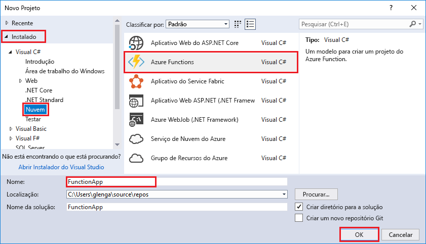

O modelo de projeto do Azure Functions no Visual Studio cria um projeto que pode ser publicado em um aplicativo de funções no Azure. Um aplicativo de funções permite a você agrupar funções como uma unidade lógica para facilitar o gerenciamento, implantação e compartilhamento de recursos.   

Clique com o botão direito do mouse no nó do projeto no **Gerenciador de Soluções**, escolha **Adicionar** > **Novo Item**. Escolha **Azure Function** na caixa de diálogo.

No diálogo **Novo Projeto**, expanda o nó **Visual C#** > **Cloud**, selecione **Azure Functions**, digite um **Nome** para seu projeto e clique em **OK**. O nome do aplicativo de funções deve ser válido como um namespace do C# e, portanto, não use outros caracteres não alfanuméricos, hífens ou sublinhados. 

