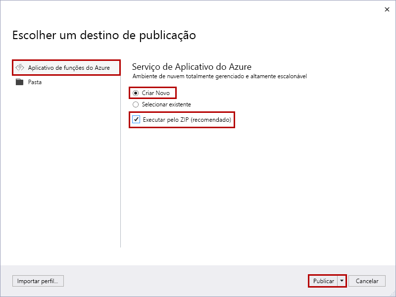
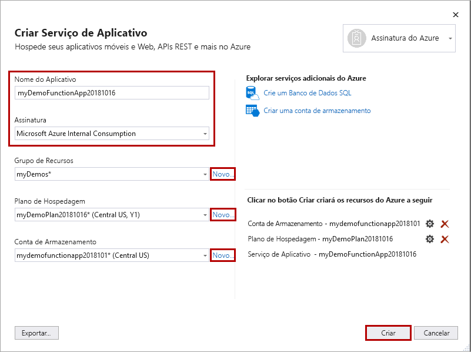
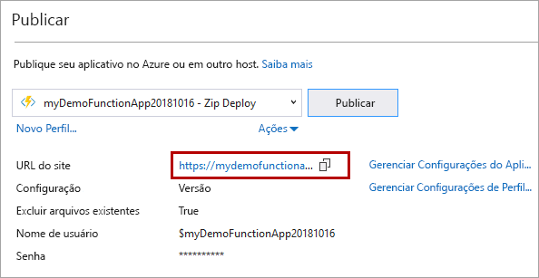

1. No **Gerenciador de Soluções**, clique com o botão direito do mouse no nome do projeto e selecione **Publicar**.

2. Selecione **Aplicativo de Funções do Azure**, escolha **Criar Novo** e selecione **Publicar**.

    

    Quando você habilita **Executar do Zip**, o aplicativo de funções no Azure entra no modo somente leitura e é executado diretamente no pacote de implantação. Para obter mais informações, consulte [Executar o Azure Functions de um arquivo de pacote](../articles/azure-functions/run-functions-from-deployment-package.md).
     
    >[!CAUTION]
    >Quando você escolhe **selecionar existente**, todos os arquivos no aplicativo de funções existente no Azure são substituídos pelos arquivos do projeto local. Use essa opção somente quando republicar atualizações para um aplicativo de funções existente.

3. Se você já não conectou o Visual Studio à conta do Azure, selecione **Adicionar uma conta...** .

4. No diálogo **Criar Serviço de Aplicativo**, use as configurações de **Hospedagem** conforme especificadas na tabela abaixo da imagem:

    

    | Configuração      | Valor sugerido  | DESCRIÇÃO                                |
    | ------------ |  ------- | -------------------------------------------------- |
    | **Nome do aplicativo** | Nome globalmente exclusivo | Nome que identifica seu novo aplicativo de funções de forma exclusiva. |
    | **Assinatura** | Escolha sua assinatura | A assinatura do Azure a utilizar. |
    | **[Grupo de Recursos](../articles/azure-resource-manager/resource-group-overview.md)** | myResourceGroup |  Nome do grupo de recursos no qual criar o seu aplicativo de funções. Escolha **Novo** para criar um novo grupo de recursos.|
    | **[Plano do Serviço de Aplicativo](../articles/azure-functions/functions-scale.md)** | Plano de consumo | Escolha **Consumo** em **Tamanho** após clicar em **Novo** para poder criar um plano sem servidor. Também, escolha um **Local** em uma [região](https://azure.microsoft.com/regions/) perto de você ou perto de outros serviços que suas funções acessam. Quando você executa em um plano diferente de **Consumo**, deve gerenciar o [dimensionamento de seu aplicativo de funções](../articles/azure-functions/functions-scale.md).  |
    | **[Conta de armazenamento](../articles/storage/common/storage-quickstart-create-account.md)** | Conta de armazenamento de uso geral | Uma conta de armazenamento do Azure é necessária para o tempo de execução de funções. Clique em **Novo** para criar uma conta de armazenamento de uso geral. Você também pode usar uma conta existente que atenda aos [requisitos da conta de armazenamento](../articles/azure-functions/functions-scale.md#storage-account-requirements).  |

5. Clique em **Criar** para criar um aplicativo de função e recursos relacionados no Azure com essas configurações e implantar seu código de projeto de função. 

6. Após a conclusão da implantação, anote o valor da **URL do Site**, que é o endereço do seu aplicativo de funções no Azure.

    
