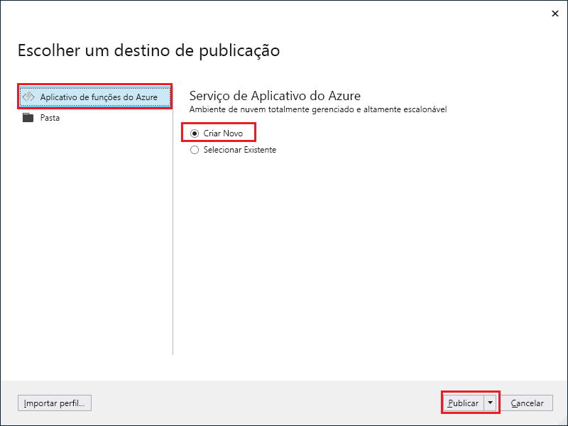

1. No **Gerenciador de Soluções**, clique com o botão direito do mouse no nome do projeto e selecione **Publicar**.

2. Selecione **Aplicativo de Funções do Azure**, escolha **Criar Novo** e selecione **Publicar**.

    

2. Se você já não conectou o Visual Studio à conta do Azure, selecione **Adicionar uma conta...** .

3. No diálogo **Criar Serviço de Aplicativo**, use as configurações de **Hospedagem** conforme especificadas na tabela abaixo da imagem:

    

    | Configuração      | Valor sugerido  | DESCRIÇÃO                                |
    | ------------ |  ------- | -------------------------------------------------- |
    | **Nome do aplicativo** | Nome globalmente exclusivo | Nome que identifica seu novo aplicativo de funções de forma exclusiva. |
    | **Assinatura** | Escolha sua assinatura | A assinatura do Azure a utilizar. |
    | **[Grupo de Recursos](../articles/azure-resource-manager/resource-group-overview.md)** | myResourceGroup |  Nome do grupo de recursos no qual criar o seu aplicativo de funções. Escolha **Novo** para criar um novo grupo de recursos.|
    | **[Plano do Serviço de Aplicativo](../articles/azure-functions/functions-scale.md)** | Plano de consumo | Escolha **Consumo** em **Tamanho** após clicar em **Novo** para poder criar um novo plano. Também, escolha um **Local** em uma [região](https://azure.microsoft.com/regions/) perto de você ou perto de outros serviços que suas funções acessam.  |
    | **[Conta de armazenamento](../articles/storage/common/storage-create-storage-account.md#create-a-storage-account)** | Conta de armazenamento de uso geral | Uma conta de armazenamento do Azure é necessária para o tempo de execução de funções. Clique em **Novo** para criar uma conta de armazenamento de uso geral ou use uma existente.  |

4. Clique em **Criar** para criar um aplicativo de função e recursos relacionados no Azure com essas configurações e implantar seu código de projeto de função. 

5. Após a conclusão da implantação, anote o valor da **URL do Site**, que é o endereço do seu aplicativo de funções no Azure.

    
