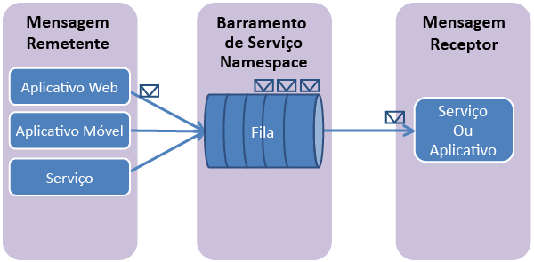

## O que são as filas do Barramento de Serviço?

Filas do Barramento de Serviço dão suporte a um modelo de comunicação de **sistema de mensagens agenciado**. Ao usar filas, os componentes de um aplicativo distribuído não se comunicam diretamente uns com os outros, mas trocam mensagens por meio de uma fila, que atua como um intermediário (agente). Um produtor de mensagem (remetente) transmite uma mensagem para a fila e, em seguida, continua o processamento. De forma assíncrona, um consumidor de mensagem (receptor) recebe a mensagem da fila e a processa. O produtor não precisa esperar por uma resposta do consumidor a fim de continuar a processar e enviar mais mensagens. As filas oferecem entrega de mensagem do tipo **FIFO (primeiro a entrar, primeiro a sair)** para um ou mais consumidores concorrentes. Ou seja, as mensagens são normalmente recebidas e processadas pelos receptores na ordem em que foram adicionadas à fila, sendo que cada mensagem é recebida e processada por apenas um consumidor de mensagem.

Filas do Barramento de Serviço são uma tecnologia de uso geral que pode ser usada para uma grande variedade de cenários:

-   Comunicação entre as funções Web e de trabalho em um aplicativo multicamada do Azure.
-   Comunicação entre aplicativos locais e aplicativos hospedados pelo Azure em uma solução híbrida.
-   Comunicação entre os componentes de um aplicativo distribuído executado localmente em diferentes organizações ou departamentos de uma organização.

O uso de filas permite que você escale horizontalmente seus aplicativos com mais facilidade e concede mais resiliência à sua arquitetura.

## Criar um namespace de serviço

Para começar a usar filas do Barramento de Serviço no Azure, primeiro crie um namespace de serviço. Um namespace fornece um contêiner de escopo para endereçar recursos do barramento de serviço dentro de seu aplicativo.

Para criar um namespace de serviço:

1.  Faça logon no [Portal de Gerenciamento do Azure][].

2.  No painel de navegação esquerdo do Portal de Gerenciamento, clique em**Service Bus**.

3.  No painel inferior do Portal de Gerenciamento, clique em **Criar**. 

4.  No diálogo **Adicionar um novo namespace**, digite um nome de namespace. O sistema imediatamente verifica para ver se o nome está disponível. 

5.  Depois de verificar se o nome do namespace está disponível, escolha o país ou a região em que o namespace deve ser hospedado (certifique-se de usar o mesmo país/região em que você está implantando seus recursos de computação).

	IMPORTANTE: selecione a **mesma região** que você pretende escolher para implantar seu aplicativo. Isso lhe dará o melhor desempenho.

6. 	Deixe os outros campos na caixa de diálogo com seus valores padrão (**Mensagens** e **Camada padrão**), em seguida, clique na marca de seleção. Agora, o sistema cria o seu namespace e o habilita. Talvez você precise aguardar vários minutos, enquanto o sistema provisiona recursos para sua conta.

	

O namespace que você criou demora algum tempo para ser ativado, e então aparece no portal de gerenciamento. Aguarde até que o status do namespace seja **Ativo** para continuar.

## Obter as credenciais de gerenciamento padrão do namespace

A fim de executar operações de gerenciamento, como criar uma fila no novo namespace, obtenha as credenciais de gerenciamento para o namespace. Você pode obter essas credenciais do Portal de Gerenciamento do Azure ou do Gerenciador de Servidores do Visual Studio.

###Para obter as credenciais de gerenciamento do portal

1.  No painel de navegação esquerdo, clique no nó **Barramento de Serviço** para exibir a lista de namespaces disponíveis: 

2.  Selecione o namespace que você acabou de criar na lista abaixo: 

3.  Clique em **Informações de Conexão**. 

4.  No painel **Acessar as informações de conexão**, encontre a cadeia de conexão que contém a chave SAS e o nome da chave.

	
    

4.  Anote a chave ou copie-a na área de transferência.

###Para obter credenciais de gerenciamento do Gerenciador de Servidores

Para obter informações de conexão usando o Visual Studio em vez do Portal de Gerenciamento, siga o procedimento descrito [aqui](http://msdn.microsoft.com/library/ff687127.aspx), na seção intitulada **Para conectar-se ao Azure no Visual Studio**. Quando você entra no Azure, o nó **Barramento de Serviço** na árvore **Azure** no Gerenciador de Servidores é automaticamente populado com os namespaces que você criou. Clique com o botão direito do mouse em qualquer namespace e, em seguida, clique em **Propriedades** para ver a cadeia de conexão e outros metadados associados a esse namespace exibido no painel **Propriedades** do Visual Studio.

Anote o valor **SharedAccessKey** ou copie-o para a área de transferência:

![][34]

  [Azure Management Portal]: http://manage.windowsazure.com
  [Portal de Gerenciamento do Azure]: http://manage.windowsazure.com

  [34]: ./media/howto-service-bus-queues/VSProperties.png

<!---HONumber=62-->