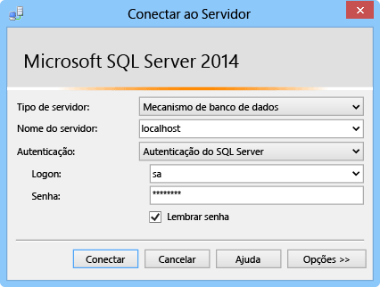

Esta seção mostra como instalar um SQL Server Express, habilitar o TCP/IP, definir uma porta estática e criar um banco de dados que pode ser usado com conexões híbridas.  

### Instalar SQL Server Express
Para usar um banco de dados SQL Server local ou SQL Server Express com uma conexão híbrida, o TCP/IP precisa ser habilitado em uma porta estática. As instâncias padrão no SQL Server usam a porta estática 1433, ao passo que instâncias nomeadas não. Por isso, instalaremos a instância padrão. Se já tiver a instância padrão do SQL Server Express instalada, você pode ignorar esta seção.

1. Para instalar o SQL Server Express, execute o arquivo **SQLEXPRWT_x64_ENU.exe** ou **SQLEXPR_x86_ENU.exe** que você baixou. O assistente do Centro de Instalação do SQL Server é exibido.
2. Escolha **Nova instalação independente do SQL Server ou adicionar recursos a uma instalação existente**, siga as instruções, aceitando as escolhas e configurações padrão, até que chegue à página **Configuração de Instância**.
3. Na página **Configuração da Instância**, escolha **Instância Padrão**, em seguida, aceite as configurações padrão na página **Configuração do Servidor**.
   
   > [!NOTE]
   > Se já tiver uma instância padrão do SQL Server instalada, você pode pular para a próxima seção e usar essa instância com conexões híbridas. 
   > 
   > 
4. Na página **Configuração do Mecanismo do Banco de Dados**, em **Modo de Autenticação**, selecione **Modo Misto (autenticação de SQL Server e autenticação do Windows)** e forneça uma senha segura para a conta do administrador **sa** interna.
   
    Neste tutorial, você irá utilizar autenticação de SQL Server. Não se esqueça da senha fornecida, pois você precisará dela mais tarde.
5. Encerre o assistente para concluir a instalação.

### Habilitar TCP/IP e configurar uma porta estática
Esta seção usa o SQL Server Configuration Manager, que foi instalado quando você instalou o SQL Server Express, para habilitar TCP/IP e configurar um endereço IP estático. 

1. Siga as etapas em [Habilitar Protocolo de Rede TCP/IP para SQL Server](http://technet.microsoft.com/library/hh231672%28v=sql.110%29.aspx) para habilitar o acesso de TCP/IP à instância.
2. (Opcional) Se não for possível usar a instância padrão, você deverá seguir as etapas em [Configurar um servidor para escutar em uma porta TCP específica ](https://msdn.microsoft.com/library/ms177440.aspx) para definir uma porta estática para a instância. Se concluir esta etapa, você se conectará usando a nova porta que definir, e não a porta 1433.
3. (Opcional) Se necessário, adicione exceções no firewall para permitir acesso remoto ao processo do SQL Server (sqlservr.exe).

### Criar um novo banco de dados na instância local do SQL Server
1. No SQL Server Management Studio, conecte-se ao SQL Server que você acabou de instalar. (Se a caixa de diálogo **Conectar ao Servidor** não for exibida automaticamente, navegue para o **Gerenciador de Objetos** no painel esquerdo, clique em **Conectar** e, depois, clique em **Mecanismo de Banco de Dados**.)     
   
    
   
    Para **Tipo de servidor**, selecione **Mecanismo de Banco de Dados**. Para **Nome de servidor**, use **localhost** ou o nome do computador em que instalou o SQL Server. Escolha **Autenticação do SQL Server**e forneça a senha para a autenticação de servidor que você criou anteriormente. 
2. Para criar um novo banco de dados utilizando o SQL Server Management Studio, clique com o botão direito do mouse em **Bancos de Dados** no Gerenciador de Objetos, então clique em **Novo Bancos de Dados**.
3. Na caixa de diálogo **Novo Banco de Dados**, digite `OnPremisesDB` e clique em **OK**. 
4. No Pesquisador de Objetos, se expandir o item **Bancos de Dados**, você verá que o novo banco de dados foi criado.

### Criar um novo logon do SQL Server e definir permissões
Finalmente, você criará um novo logon do SQL Server com permissões restritas. O serviço do Azure se conectará ao SQL Server no local usando esse logon, e não o logon de autenticação do servidor interno, que possui permissões completas no servidor.

1. No Pesquisador de Objetos do SQL Server Management Studio, clique com o botão direito no banco de dados **OnPremisesDB** e clique em **Nova Consulta**.
2. Cole a seguinte consulta TSQL na janela de consulta.
   
       USE [master]
       GO
   
       /* Replace the PASSWORD in the following statement with a secure password. 
          If you save this script, make sure that you secure the file to 
          securely maintain the password. */ 
       CREATE LOGIN [HybridConnectionLogin] WITH PASSWORD=N'<**secure_password**>', 
           DEFAULT_DATABASE=[OnPremisesDB], DEFAULT_LANGUAGE=[us_english], 
           CHECK_EXPIRATION=OFF, CHECK_POLICY=ON
       GO
   
       USE [OnPremisesDB]
       GO
   
       CREATE USER [HybridConnectionLogin] FOR LOGIN [HybridConnectionLogin] 
       WITH DEFAULT_SCHEMA=[dbo]
       GO
   
       GRANT CONNECT TO [HybridConnectionLogin]
       GRANT CREATE TABLE TO [HybridConnectionLogin]
       GRANT CREATE SCHEMA TO [HybridConnectionLogin]
       GO  
3. No script anterior, substitua a cadeia de caracteres `<**secure_password**>` por uma senha segura para o novo *HybridConnectionsLogin*.
4. **Execute** a consulta para criar o novo logon e conceder as permissões necessárias no banco de dados local.

<!--HONumber=Jan17_HO3-->

