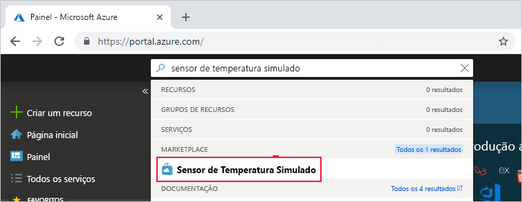
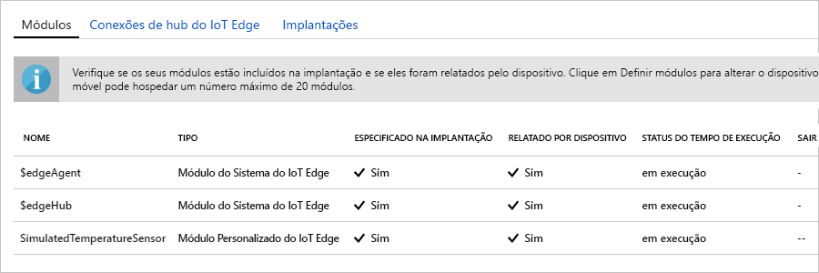

Um dos principais recursos do Azure IoT Edge é a possibilidade de implantar módulos em seus dispositivos IoT Edge na nuvem. Um módulo IoT Edge é um pacote executável implementado como contêiner. Nesta seção, implantaremos um módulo pré-criado na [seção Módulos do IoT Edge do Azure Marketplace](https://azuremarketplace.microsoft.com/marketplace/apps/category/internet-of-things?page=1&subcategories=iot-edge-modules). Esse módulo gera uma telemetria simulada para o dispositivo IoT Edge.

1. No [portal do Azure](https://portal.azure.com), insira **Sensor de Temperatura Simulada** na pesquisa e abra o resultado do Marketplace.

   

2. Escolha um dispositivo IoT Edge para receber esse módulo. Em **Dispositivos de Destino para o Módulo do IoT Edge**, forneça as seguintes informações:

   1. **Assinatura**: selecione a assinatura que contém o hub IoT que está sendo usado.

   2. **Hub IoT**: selecione o nome do hub IoT que está sendo usado.

   3. **Nome do Dispositivo IoT Edge**: se você usou o nome de dispositivo sugerido anteriormente neste início rápido, insira **myEdgeDevice**. Ou selecione **Encontrar Dispositivo** para escolher um em uma lista de dispositivos no hub IoT. 
   
   4. Selecione **Criar**.

3. Agora que você escolheu um módulo do IoT Edge do Azure Marketplace e escolheu um dispositivo IoT Edge para receber o módulo, você será levado para um assistente de três etapas que ajudará você a definir exatamente como o módulo será implantado. Na etapa **Adicionar Módulos** do assistente, observe que o módulo **SimulatedTemperatureSensor** é populado automaticamente. Nos tutoriais, você usará essa página para adicionar outros módulos à implantação. Para este início rápido, basta implantar esse único módulo. Selecione **Avançar** para continuar e ir para a próxima etapa do assistente.

4. Na etapa **Especificar Rotas** do assistente, você definirá como as mensagens são passadas entre os módulos e ao Hub IoT. Para o início rápido, você deseja que todas as mensagens de todos os módulos sejam direcionadas ao Hub IoT (`$upstream`). Se ele não for populado automaticamente, adicione o seguinte código e selecione **Avançar**:

   ```json
    {
    "routes": {
        "route": "FROM /messages/* INTO $upstream"
        }
    }
   ```

5. Na etapa **Examinar Implantação** do assistente, você poderá visualizar o arquivo JSON que define todos os módulos implantados no dispositivo IoT Edge. Observe que o módulo **SimulatedTemperatureSensor** está incluído, bem como dois módulos de sistema adicionais chamados **edgeAgent** e **edgeHub**. Selecione **Enviar** quando terminar de examiná-lo.

   Quando você envia uma nova implantação para um dispositivo IoT Edge, nada é enviado por push para o dispositivo. Em vez disso, o dispositivo consulta o Hub IoT regularmente para verificar se há novas instruções. Quando ele vê as novas informações de implantação, o dispositivo usa isso para efetuar pull das imagens de módulo da nuvem e começa a executar os módulos localmente. Esse processo pode levar alguns minutos. 

6. Depois que você enviar os detalhes da implantação de módulo, o assistente direcionará você à página **IoT Edge** do hub IoT. Selecione seu dispositivo na lista de dispositivos IoT Edge para ver os detalhes. 

7. Na página de detalhes do dispositivo, role a tela para baixo até a seção **Módulos**. Três módulos deverão estar listados: $edgeAgent, $edgeHub e SimulatedTemperatureSensor. Se um ou mais módulos estiverem listados conforme especificado na implantação, mas não forem relatados pelo dispositivo, isso significará que o dispositivo IoT Edge ainda está iniciando os módulos. Aguarde alguns instantes e selecione **Atualizar** na parte superior da página. 

   
