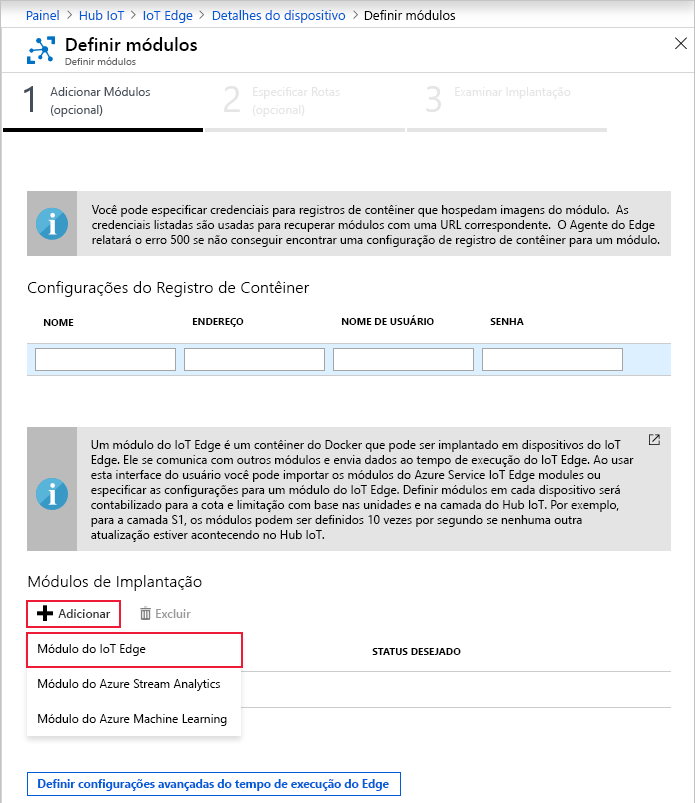
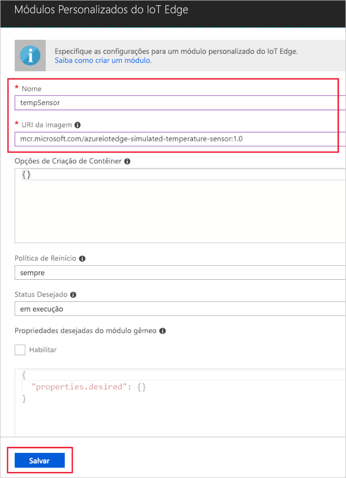

Um dos principais recursos do Azure IoT Edge é a possibilidade de implantar módulos em seus dispositivos IoT Edge na nuvem. Um módulo IoT Edge é um pacote executável implementado como contêiner. Nesta seção, você implanta um módulo que gera uma telemetria para seu dispositivo simulado.

1. No portal do Azure, navegue para o hub IoT.

2. Acesse o **IoT Edge** em **Gerenciamento de Dispositivo Automático** e selecione seu dispositivo IoT Edge.

3. Selecione **Definir Módulos**. Um assistente de três etapas é aberto no portal, que orienta você por meio da adição de módulos, especificando as rotas e analisando a implantação. 

4. Na etapa **Adicionar módulos** do assistente, localize a seção **Módulos de implantação**. Clique em **Adicionar**, depois selecione **Módulo do IoT Edge**.

   

5. No campo **Nome**, insira `tempSensor`.

6. No campo **URI da Imagem**, insira `mcr.microsoft.com/azureiotedge-simulated-temperature-sensor:1.0`.

7. Deixe as outras configurações inalteradas e selecione **Salvar**.

   

8. Na primeira etapa do assistente, selecione **Avançar**.

9. No assistente, na etapa **Especificar rotas**, você deve ter uma rota padrão que envie todas as mensagens de todos os módulos para o Hub IoT. Caso contrário, adicione o código a seguir e selecione **Avançar**.

   ```json
   {
       "routes": {
           "route": "FROM /messages/* INTO $upstream"
       }
   }
   ```

10. No assistente, na etapa **Revisar implantação**, selecione **Enviar**.

11. Volte para a página de detalhes do dispositivo e selecione **Atualizar**. Além de módulo edgeAgent, criado quando você iniciou o serviço pela primeira vez, poderá ser visto outro módulo de tempo de execução, chamado **edgeHub**, e o módulo **tempSensor** listados.

   Pode demorar alguns minutos até que os novos módulos apareçam. O dispositivo IoT Edge tem de recuperar suas novas informações de implantação da nuvem, iniciar os contêineres e depois relatar o novo status de volta ao Hub IoT. 

   
