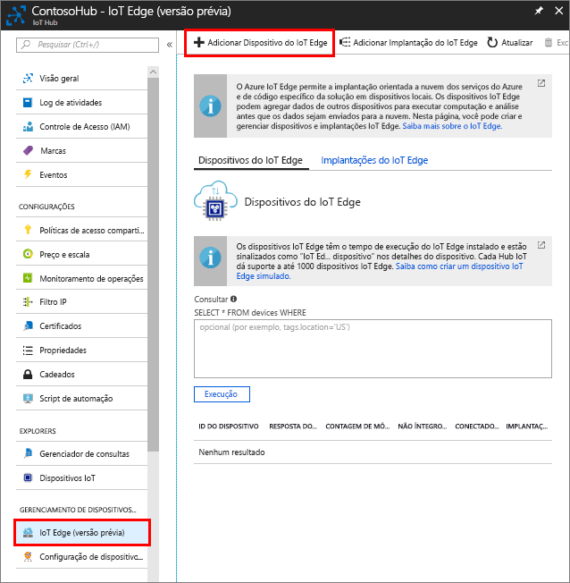

Crie uma identidade de dispositivo para seu dispositivo simulado para que ele possa se comunicar com o hub IoT. Como os dispositivos IoT Edge se comportam e podem ser gerenciados diferentemente de dispositivos IoT comuns, declare esse para ser um dispositivo de IoT Edge desde o início. 

1. No portal do Azure, navegue para o hub IoT.
1. Selecione **IoT Edge** e então selecione **Adicionar Dispositivo do IoT Edge**.

   

1. Dê o seu dispositivo simulado uma ID de dispositivo exclusivo.
1. Selecione **Salvar** para adicionar seu dispositivo.
1. Selecione seu dispositivo na lista de dispositivos.
1. Copie o valor de **Cadeia de conexão — chave primária** e salve-o. Você usará esse valor para configurar o tempo de execução de IoT Edge na próxima seção. 

