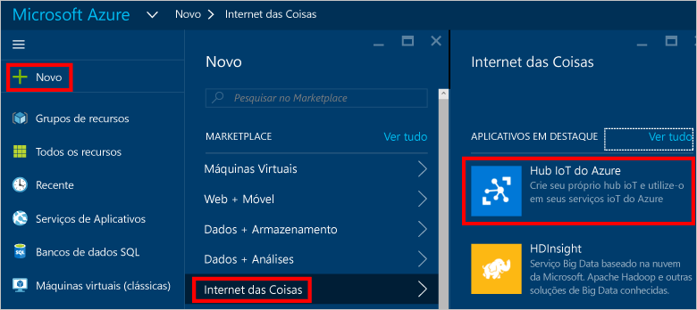
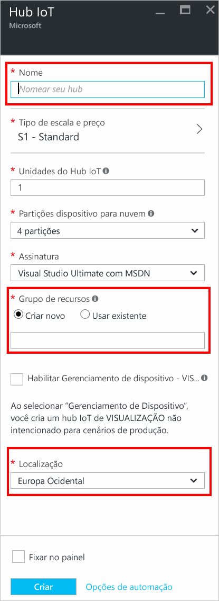
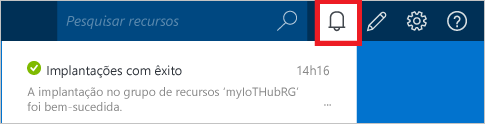
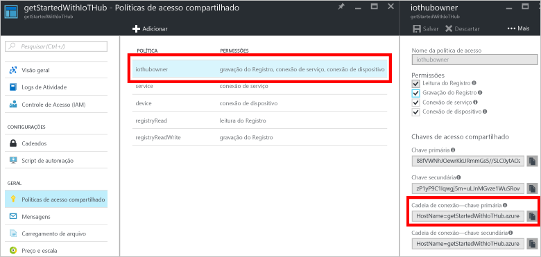

## Crie um hub IoT
Crie um Hub IoT ao qual o aplicativo de dispositivo simulado poderá se conectar. As etapas a seguir mostram como concluir esta tarefa usando o portal do Azure.

1. Entre no [portal do Azure](https://portal.azure.com/).

2. Selecione **Criar um recurso** > **Internet das Coisas** > **Hub IoT**.
   
    

3. No painel **Hub IoT**, insira as seguintes informações para o Hub IoT:

   * **Assinatura**: escolha a assinatura que deseja usar para criar esse hub IoT.

   * **Grupo de recursos**: criar um grupo de recursos para hospedar o hub IoT ou usar um existente. Para saber mais, veja [Usar os grupos de recursos para gerenciar seus recursos do Azure](../articles/azure-resource-manager/resource-group-portal.md).

   * **Região**: selecione o local mais próximo de você.

   * **Nome**: cria um nome para o hub IoT. Caso o nome inserido esteja disponível, uma marca de seleção verde será exibida.

   [!INCLUDE [iot-hub-pii-note-naming-hub](iot-hub-pii-note-naming-hub.md)]

   

4. Selecione **Próximo: Tamanho e escala** para continuar criando o hub IoT. 

5. Escolha **Tipo de preço e escala**. Para este artigo, selecione a camada **F1 – Gratuita**, caso ela ainda esteja disponível em sua assinatura. Para saber mais, confira [Tipo de escala e preço](https://azure.microsoft.com/pricing/details/iot-hub/).

   

6. Selecione **Examinar + criar**.

7. Examine as informações do hub IoT e clique em **Criar**. A criação do seu hub IoT pode levar alguns minutos. Você pode monitorar o progresso no painel **Notificações**.

8. Quando seu novo Hub IoT estiver pronto, clique no bloco dele no Portal do Azure para abrir a janela Propriedades. Agora que você criou um hub IoT, localize as informações importantes que você usa para se conectar a dispositivos e aplicativos para o hub IoT. Clique em **Políticas de acesso compartilhado**.
   
9. Em **Políticas de acesso compartilhado**, selecione a política **iothubowner**. Copie a **Cadeia de conexão – chave primária** do Hub IoT para uso futuro. Para obter mais informações, consulte [Controle de acesso](../articles/iot-hub/iot-hub-devguide-security.md) no "Guia do desenvolvedor do Hub IoT".
   
    