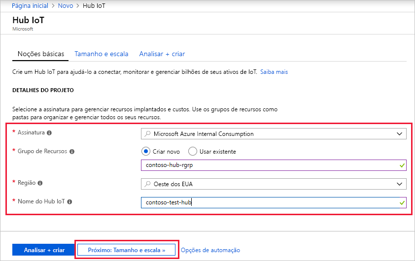
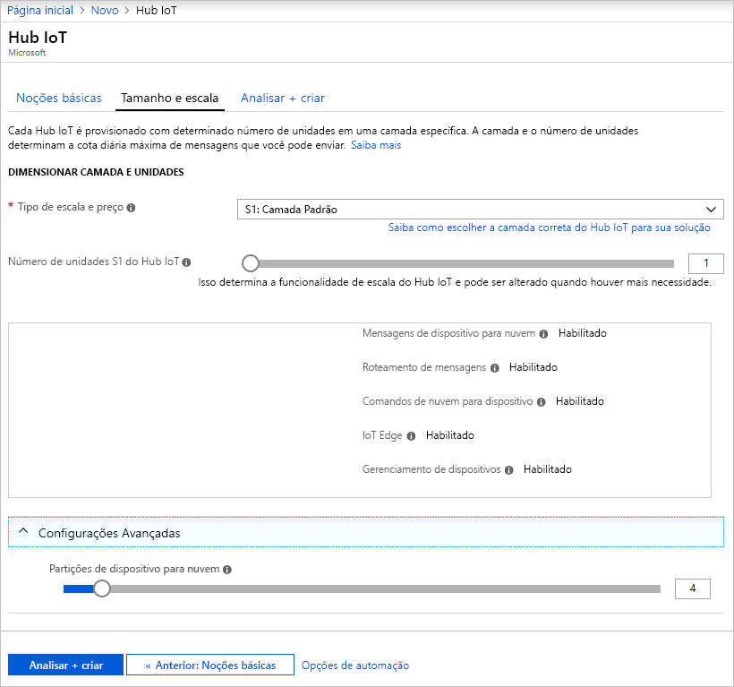
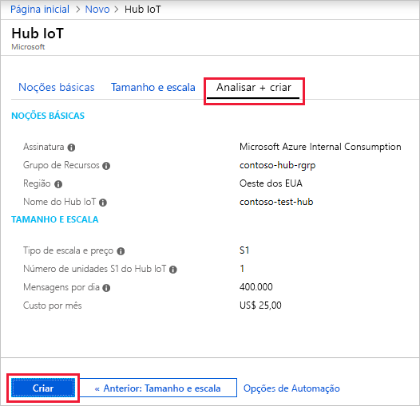

Esta seção descreve como criar um hub IoT usando o [portal do Azure](https://portal.azure.com).

1. Faça logon no [Portal do Azure](https://portal.azure.com). 

2. Escolha +**Criar um recurso**, então escolha **Internet das Coisas**.

3. Clique em **Hub IoT** na lista à direita. Você verá a primeira tela para a criação de um Hub IoT.

   

   Preencha os campos.

   **Assinatura**: selecione a assinatura a ser usada para o hub IoT.

   **Grupo de Recursos**: você pode criar um novo grupo de recursos ou usar um grupo de recursos existente. Para criar um novo, clique em **Criar novo** e preencha o nome que deseja usar. Para usar um grupo de recursos existente, clique em **Usar existente** e selecione o grupo de recursos na lista suspensa. Para saber mais, veja [Usar os grupos de recursos para gerenciar seus recursos do Azure](../articles/azure-resource-manager/resource-group-portal.md).

   **Região**: é a região na qual você deseja que o hub esteja localizado. Selecione o local mais próximo de você na lista suspensa.

   **Nome do Hub IoT**: insira o nome para o Hub IoT. Esse nome deve ser globalmente exclusivo. Caso o nome inserido esteja disponível, uma marca de seleção verde será exibida.

   [!INCLUDE [iot-hub-pii-note-naming-hub](iot-hub-pii-note-naming-hub.md)]

4. Clique em **Próximo: Tamanho e escala** para continuar criando o hub IoT.

   

   Nesta tela, você pode usar os padrões e clicar em **Examinar + Criar** na parte inferior. 

   **Camada de escala e preço**: é possível escolher entre várias camadas, dependendo de quantos recursos você quer e quantas mensagens você envia por dia através de sua solução. A camada gratuita destina-se a testes e avaliação. Ela permite que 500 dispositivos sejam conectados ao Hub IoT e até 8.000 mensagens por dia. Cada assinatura do Azure pode criar um Hub IoT na camada gratuita. 

   **Unidades do Hub IoT**: o número de mensagens permitidas por unidade ao dia depende do tipo de preço do seu hub. Por exemplo, se você quiser que o Hub IoT dê suporte à entrada de 700.000 mensagens, escolha duas unidades da camada S1.

   Para obter detalhes sobre as outras opções da camada, consulte [Escolher a camada certa do Hub IoT](../articles/iot-hub/iot-hub-scaling.md).

   **Partições Avançadas/Dispositivo para nuvem**: essa propriedade relaciona as mensagens de dispositivo para nuvem com o número de leitores simultâneos das mensagens. A maioria dos hubs IoT precisa apenas de quatro partições. 

5. Clique em **Revisar + criar** para examinar suas opções. Você verá algo semelhante a esta tela.

   

6. Clique em **Criar** para criar seu novo hub IoT. Criar o hub leva alguns minutos.
