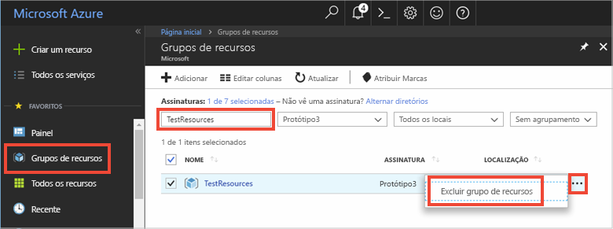

Se você pretende continuar para o próximo artigo recomendado, é possível manter os recursos já criados e reutilizá-los.

Caso contrário, você pode excluir os recursos do Azure criados neste artigo para evitar encargos. 

> [!IMPORTANT]
> A exclusão de um grupo de recursos é irreversível. O grupo de recursos e todos os recursos contidos nele são excluídos permanentemente. Não exclua acidentalmente o grupo de recursos ou os recursos incorretos. Caso tenha criado o Hub IoT dentro de um grupo de recursos existente que contém recursos que você deseja manter, exclua apenas o próprio recurso do Hub IoT em vez de excluir o grupo de recursos.
>

Para excluir um grupo de recursos por nome:

1. Entre no [portal do Azure](https://portal.azure.com) e clique em **Grupos de recursos**.

2. Na caixa de texto **Filtrar por nome...**, digite o nome do grupo de recursos que contém seu Hub IoT. 

3. À direita do seu grupo de recursos, na lista de resultados, clique em **...**, depois em **Excluir grupo de recursos**.

    

4. Você receberá uma solicitação para confirmar a exclusão do grupo de recursos. Digite o nome do grupo de recursos novamente para confirmar e clique em **Excluir**. Após alguns instantes, o grupo de recursos, e todos os recursos contidos nele, serão excluídos.