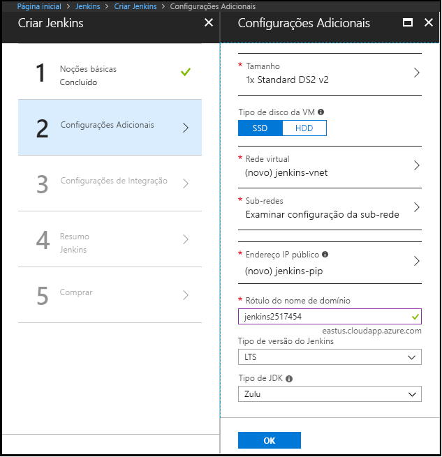

1. No navegador, abra a [imagem do Azure Marketplace para Jenkins](https://azuremarketplace.microsoft.com/marketplace/apps/azure-oss.jenkins?tab=Overview).

1. Selecione **OBTENHA AGORA**.

    

1. Depois de consultar as informações de termos e detalhes de preços, selecione **Continuar**.

    

1. Selecione **Criar** para configurar o servidor de Jenkins no portal do Azure. 

    

1. Na guia **Noções Básicas**, especifique os seguintes valores:

    - **Nome** - Digite `Jenkins`.
    - **Usuário** - Insira o nome de usuário a ser usado ao entrar na máquina virtual que está executando Jenkins.
    - **Tipo de Autenticação**, Selecione **Senha**.
    - **Senha** - Insira a senha a ser usada ao entrar na máquina virtual que está executando Jenkins.
    - **Confirmar senha** - Insira novamente a senha a ser usada ao entrar na máquina virtual que está executando Jenkins.
    - **Tipo de versão do Jenkins** - Selecione **LTS**.
    - **Assinatura** - Selecione a assinatura do Azure que você deseja para instalar o Jenkins.
    - **Grupo de recursos** - Selecione **Criar novo** e digite um nome para o grupo de recursos que serve como um contêiner lógico para a coleção de recursos que compõem sua instalação Jenkins.
    - **Local** - Selecione **Leste dos EUA**.

    

1. Selecione **OK** para prosseguir para a guia **Configurações**. 

1. Na guia **Configurações**, especifique os seguintes valores:

    - **Tamanho** - Selecione a opção de tamanho apropriado para sua máquina virtual de Jenkins.
    - **Tipo de disco de máquina virtual** - Especifique HDD (unidade de disco rígido) ou SSD (unidade de estado sólido) para indicar qual tipo de disco de armazenamento é permitido para as máquinas virtuais Jenkins.
    - **Endereço IP público** - O nome do endereço IP padrão é o nome de Jenkins que você especificou na página anterior com um sufixo de - IP. Você pode selecionar a opção para alterar esse padrão.
    - **Rótulo de nome de domínio** - Especifique o valor para a URL totalmente qualificada para a máquina virtual Jenkins.

    

1. Selecione **OK** para prosseguir para a guia **Resumo**.

1. Quando a guia **Resumo** aparece, as informações inseridas são validadas. Quando você vir a mensagem **Validação aprovada**, selecione **OK**. 

    

1. Quando a guia **Criar** aparecer, selecione **Criar** para criar a máquina virtual Jenkins. Quando o servidor estiver pronto, uma notificação aparecerá no portal do Azure.

    