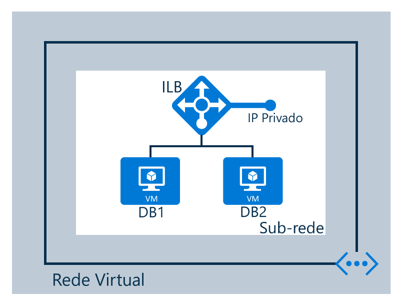

## Cenário de configuração

Neste cenário, estamos criando um balanceador de carga interno em uma rede virtual conforme mostrado na figura a seguir:

A configuração para o nosso cenário é o seguinte:

* Duas máquinas virtuais chamadas **DB1** e **DB2**
* Pontos de extremidade para o balanceador de carga interno
* Um balanceador de carga interno
