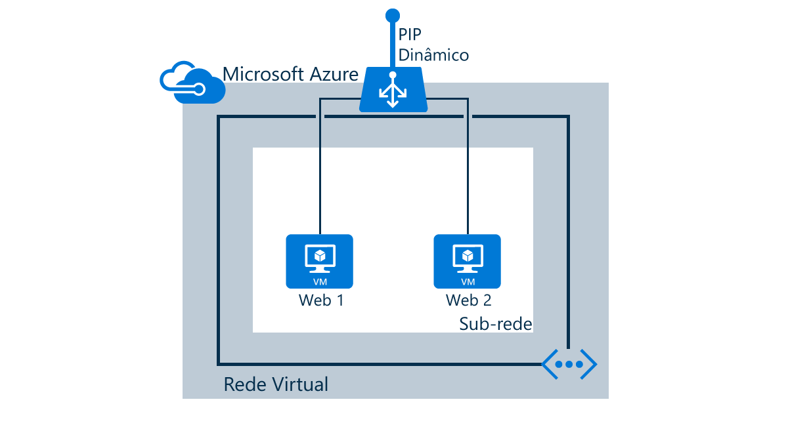

## Cenário

O cenário a seguir mostra como adicionar um balanceador de carga para duas máquinas virtuais chamadas "web1" e "web2" usando a porta 80 para receber o tráfego da Internet e enviar tráfego de rede com balanceamento de carga também para a porta 80 dos dois servidores.

<!---HONumber=Nov15_HO1-->