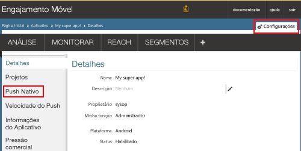
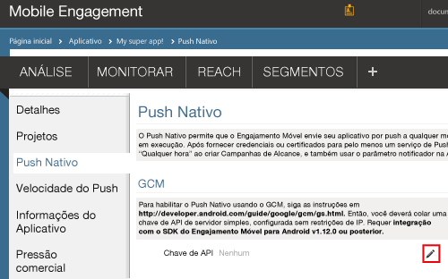
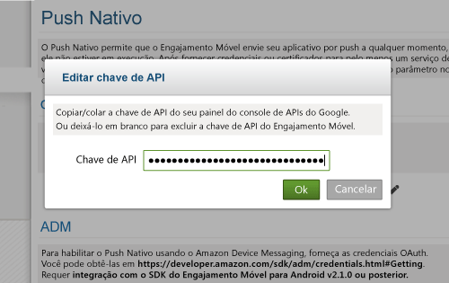
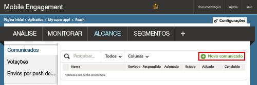
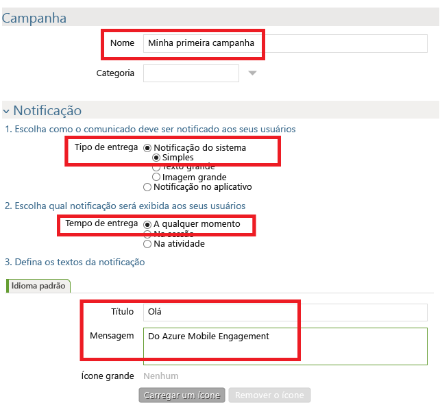
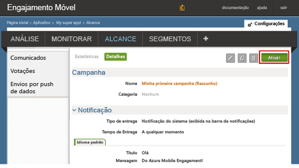

### Permitir acesso do Mobile Engagement à sua chave de API do GCM

Para permitir que o Mobile Engagement envie notificações por push em seu nome, é preciso conceder acesso à sua chave de API. Isso é feito configurando e inserindo sua chave no portal do Mobile Engagement.

1. No Portal Clássico do Azure, verifique se você está no aplicativo que estamos usando para este projeto e clique no botão **Acionar** na parte inferior:

    

2. Em seguida, clique na seção **Configurações** -> **Push Nativo** para inserir a chave do GCM:

    

3. Clique no ícone **Editar** na frente da **Chave de API**, na seção **Configurações do GCM**, como mostrado abaixo:

    

4. No menu pop-up, cole a Chave do Servidor GCM obtida antes e clique em **Ok**.

    

## Envie uma notificação para seu aplicativo

Agora criaremos uma campanha simples de notificação por push que enviará uma notificação por push para nosso aplicativo.

1. Navegue até a guia **REACH** em seu portal do Mobile Engagement

2. Clique em **Novo anúncio** para criar sua campanha de notificação por push.

    
3. Configure o primeiro campo da campanha executando as seguintes etapas:

    

    a. Nome de sua campanha.

    b. Selecione o **Tipo de entrega** como *Sistema de notificação -> Simples*: esse é o tipo de notificação por push do Android simples que apresenta um título e uma pequena linha de texto.

    c. Selecione a **Hora de entrega** como *Sempre* para permitir que o aplicativo receba uma notificação quer ele tenha sido iniciado ou não.

    d. No texto de notificação, digite o **Título** , que estará em negrito no envio por push.

    e. Em seguida, digite sua **Mensagem**
4. Role para baixo e, na seção **Conteúdo**, selecione **Somente notificação**.

    
5. Você concluiu a configuração da campanha mais básica possível. Agora, role para baixo novamente e clique no botão **Criar** para salvar sua campanha.
6. Última etapa: clique em **Ativar** para ativar sua campanha e enviar notificações por push.
   
    

