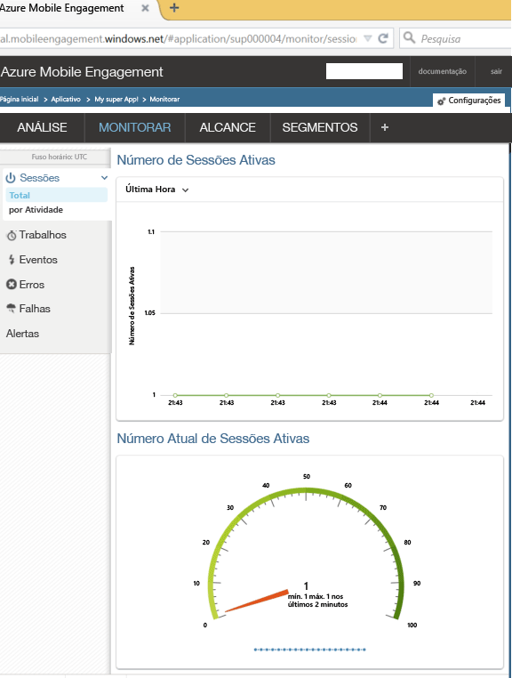

Esta seção mostra como conectar seu aplicativo ao back-end do Mobile Engagement usando o recurso de monitoramento em tempo real do Mobile Engagement.

1. Na sua conta do **Mobile Engagement do Azure** conta, selecione o aplicativo que deseja monitorar e gerenciar no portal do **Mobile Engagement**. Navegue até o portal do Mobile Engagement clicando no botão **Acionar** na parte inferior. 

	 

2. Você será encaminhado para o portal do Compromisso de Mobilidade. Se a guia Monitorar não estiver selecionada, clique em **Monitorar**.

3. O monitor está pronto para mostrar qualquer dispositivo, em tempo real, o que iniciará o aplicativo.
	 
4. Inicie o aplicativo agora. Você deverá ver uma sessão no monitor se a integração estiver correta, o que significa que seu aplicativo agora está conectado ao back-end do Compromisso de Mobilidade e está enviando dados para ele.
	
	 

<!---HONumber=AcomDC_0615_2016-->