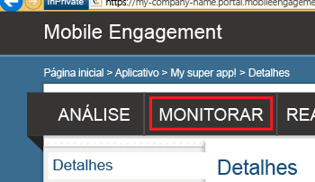

Esta seção mostra como assegurar que seu aplicativo se conecte ao back-end do Mobile Engagement usando o recurso de monitoramento em tempo real do Mobile Engagement.

1. Navegue até o portal do Mobile Engagement. Verifique se você está no aplicativo que estamos usando para este projeto e, em seguida, clique no botão **Acionar** na parte inferior.

	 

2. Você será encaminhado para o portal do Compromisso de Mobilidade. Clique na guia **Monitorar** aqui.
	 
	

3. O monitor está pronto para mostrar qualquer dispositivo, em tempo real, o que iniciará o aplicativo.
	 
4. Inicie seu aplicativo no emulador/simulador ou em um dispositivo conectado. Você deverá ver uma sessão no monitor se a integração estiver correta, o que significa que seu aplicativo agora está conectado ao back-end do Compromisso de Mobilidade e está enviando dados para ele.
	
	 

<!---HONumber=Oct15_HO1-->