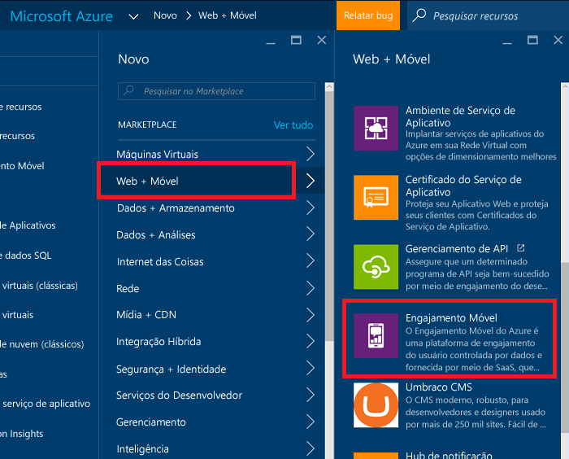
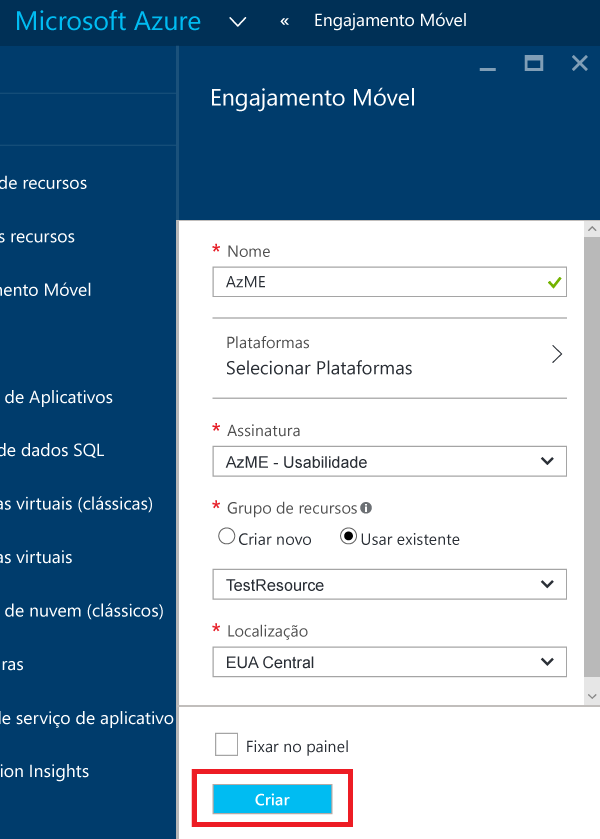
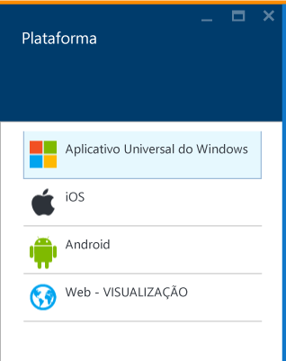
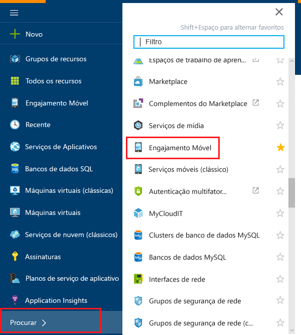
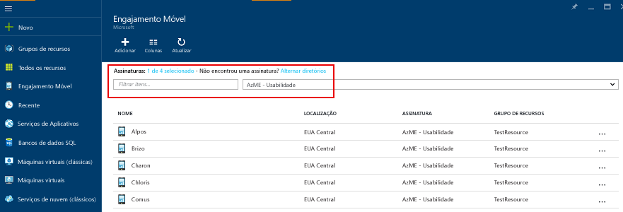
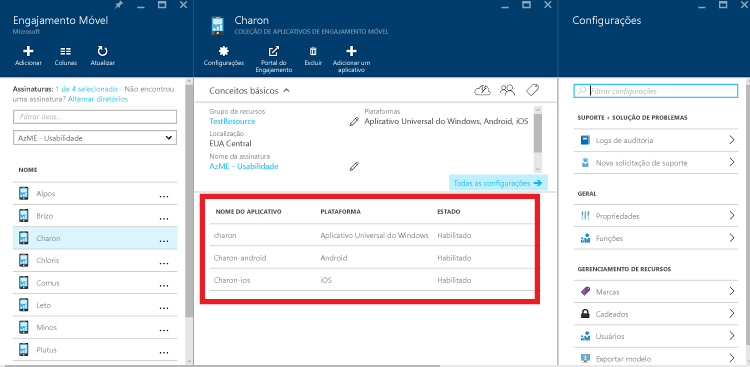
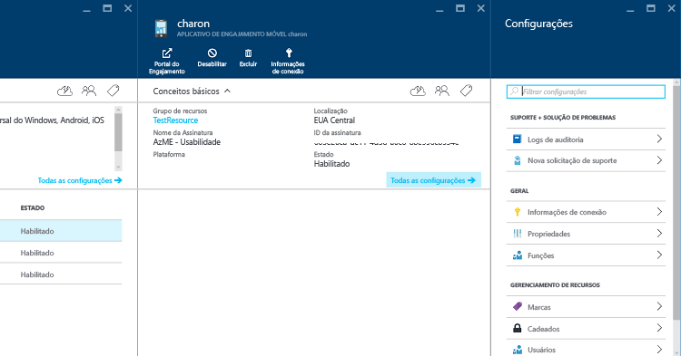
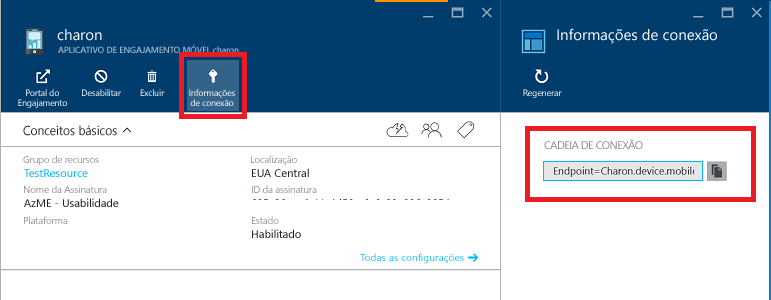

1. Faça logon no [Portal do Azure](https://portal.azure.com).
2. Clique em **Novo**, em seguida, **Web + Móvel** e **Mobile Engagement**.
   
    
3. Na folha **Nova Coleção de Aplicativos do Mobile Engagement** que aparece, você criará uma Coleção de Aplicativos em vez de um aplicativo semelhante no portal clássico do Azure. Insira as seguintes informações:
   
    
   
   * **Nome**: o nome de sua *coleção de aplicativos* 
   * **Plataformas**: selecione as plataformas de destino para seu aplicativo na folha Plataformas que será aberta. Por exemplo se você quiser um aplicativo para o iOS e o Android, então, selecione ambas as plataformas e terá dois aplicativos criados sob essa coleção de aplicativos. 
     
     
   * **Assinatura**: selecione a assinatura do Azure. 
   * **Grupo de recursos**: selecione o Grupo de recursos do Azure no qual você deseja esse recurso do Azure (Coleção de Aplicativos do Mobile Engagement). Você pode optar por criar um novo.  
   * **Local**: a região onde serão armazenados os dados sobre essa coleção de aplicativos e aplicativos.
4. Percorra as coleções de aplicativos do Mobile Engagement clicando em **Procurar** e procure **Mobile Engagement**
   
    
5. Você verá uma lista de Coleções de Aplicativos do Mobile Engagement - verifique se você tem a mesma assinatura do Azure onde criou sua Coleção de Aplicativos.
   
    
6. Clique na Coleção de Aplicativos que você criou na etapa anterior para abrir a folha de recursos Coleção de Aplicativos que mostra os diferentes aplicativos presentes dentro dessa coleção. 
   
    
7. Clique no Aplicativo criado para a plataforma para a qual você está desenvolvendo. 
   
    
8. Clique no botão de comando **Informações da Conexão** na parte superior para abrir a folha Informações da Conexão e copie a cadeia de conexão de lá. 
   
    

<!--HONumber=Oct16_HO2-->

