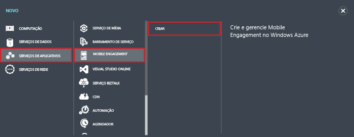
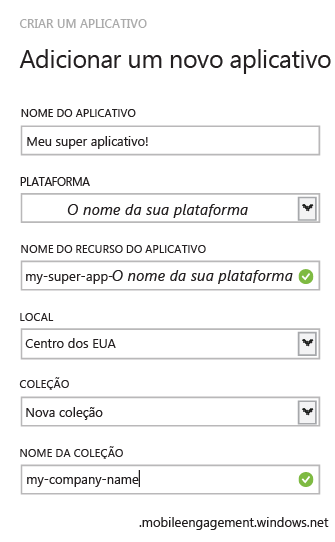
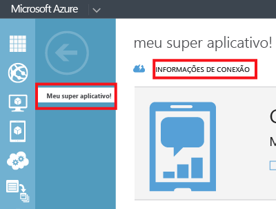

1. Faça logon no Portal de Gerenciamento do Azure e clique em **+NOVO** na parte inferior da tela.

2. Clique em **Serviços de Aplicativo**, **Mobile Engagement**, então, em **Criar**.

   	

3. No pop-up exibido, insira as seguintes informações:

   	

	- **Nome do Aplicativo**: digite o nome do seu aplicativo. 
	- **Plataforma**: a plataforma de destino para o aplicativo. Você deve criar um aplicativo de Compromisso de Mobilidade por plataforma de destino para o seu aplicativo móvel. 
	- **Nome do Recurso do Aplicativo**: nome pelo qual o aplicativo poderá ser acessado via APIs e URLs. 
	- **Local**: região/data center em que esse aplicativo e a coleção de aplicativos serão hospedados.
	- **Coleção**: selecione uma coleção criada anteriormente ou selecione “Nova coleção”.
	- **Nome da Coleção**: representa seu grupo de aplicativos. Isso garantirá que todos os seus aplicativos estejam em um grupo que permitirá cálculos agregados das métricas. Você deve usar o nome da empresa ou departamento aqui, se aplicável.

4. Selecione o aplicativo que você acabou de criar na guia **Aplicativos**.

5. Clique em **Informações da Conexão** para exibir as configurações da conexão para colocar em sua integração SDK no aplicativo móvel.

   	

6. Copiar a **Cadeia de Conexão** – isso é o que você precisará para identificar esse aplicativo no código do aplicativo e conectar-se com o Compromisso de Mobilidade por meio de seu aplicativo.

   	

<!---HONumber=Oct15_HO1-->