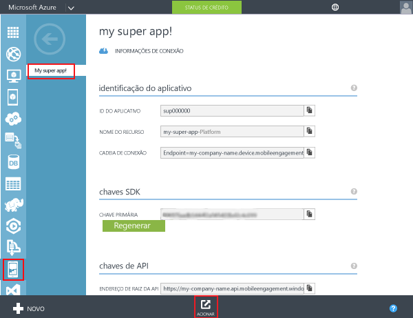
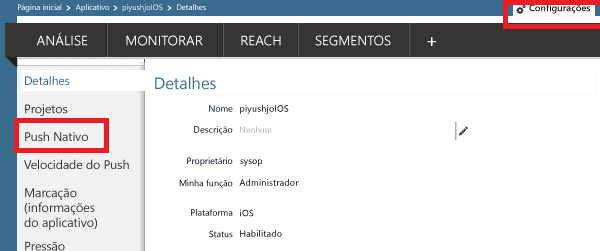
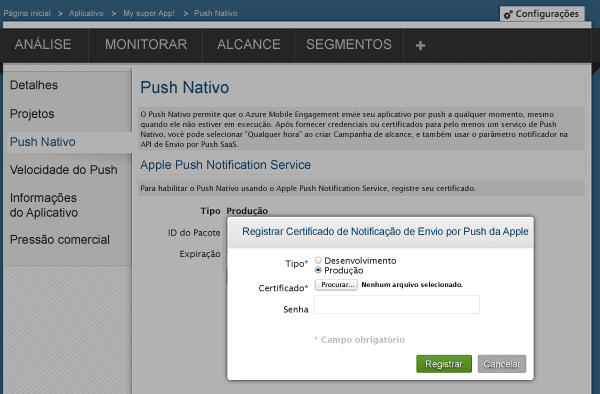
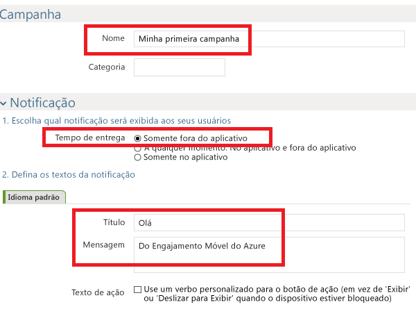
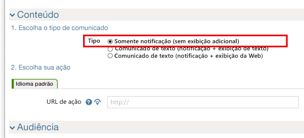
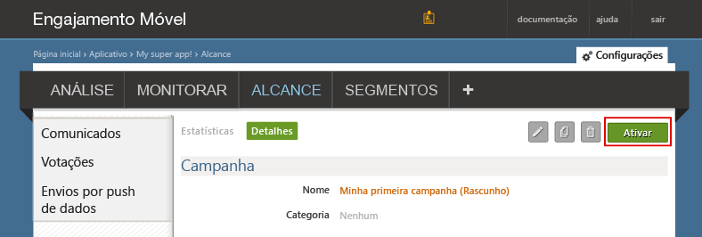
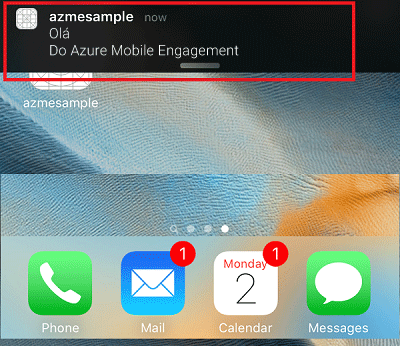
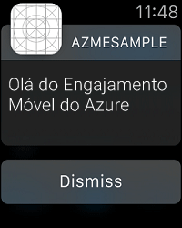

### Conceda acesso a seu Certificado Push para o Mobile Engagement
Para permitir que o Mobile Engagement envie Notificações por Push em seu nome, você precisa conceder acesso ao certificado. Isso é feito configurando e inserindo seu certificado no portal do Mobile Engagement. Certifique-se de ter o certificado .p12, conforme explicado na [documentação da Apple](https://developer.apple.com/library/prerelease/ios/documentation/IDEs/Conceptual/AppDistributionGuide/AddingCapabilities/AddingCapabilities.html#//apple_ref/doc/uid/TP40012582-CH26-SW6)

1. Navegue até o portal do Mobile Engagement. Verifique se você está no item correto e, em seguida, clique no botão **Acionar** na parte inferior:
   
    
2. Você será levado para a página **Configurações** no Portal do Compromisso. Então, clique na seção **Push Nativo** para carregar seu certificado .p12:
   
    
3. Selecione seu p12, carregue-o e digite sua senha:
   
    

## Envie uma notificação para seu aplicativo
Agora, criaremos uma campanha de Notificação por Push simples que enviará um push para nosso aplicativo:

1. Navegue até a guia **Reach** em seu portal do Mobile Engagement.
2. Clique em **Novo Comunicado** para criar sua campanha de push.
   
    
3. Configure os primeiros campos de sua campanha:
   
    
   
   * Forneça um **Nome** para sua campanha. 
   * Selecione a **Hora de entrega** como **Somente fora do aplicativo**: esse é o tipo de Apple Push Notification simples que apresenta algum texto.
   * No texto da notificação, primeiro digite o **Título** que será a primeira linha no push.
   * Em seguida, digite a **Mensagem** que será a segunda linha
4. Role para baixo e, na seção de conteúdo, selecione **Somente notificação**
   
    
5. Você concluiu a configuração da campanha mais básica possível. Agora, role para baixo novamente e clique no botão **Criar** para salvar sua campanha de notificação por push.
6. Por fim, clique em **Ativar** enviar notificação por push.
   
    
7. Você poderá receber a notificação em seu dispositivo iOS no centro de notificação dessa forma:
   
    
8. Se você tiver um Apple Watch emparelhado com este dispositivo iOS, você poderá ver a notificação em seu Apple Watch:
   
    

<!---HONumber=Nov15_HO2-->