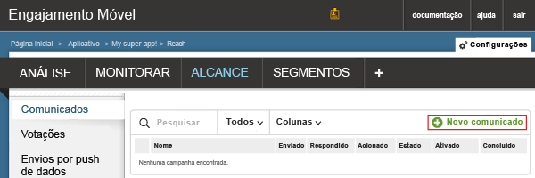
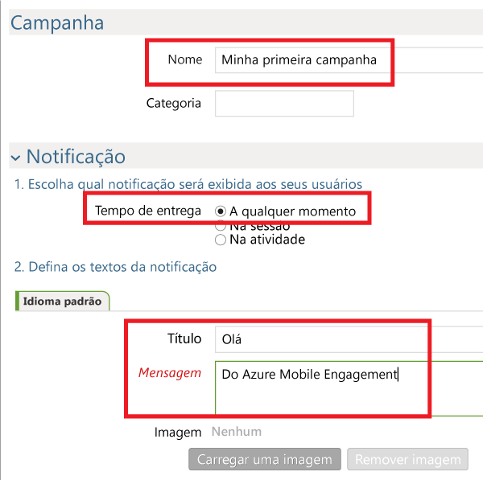
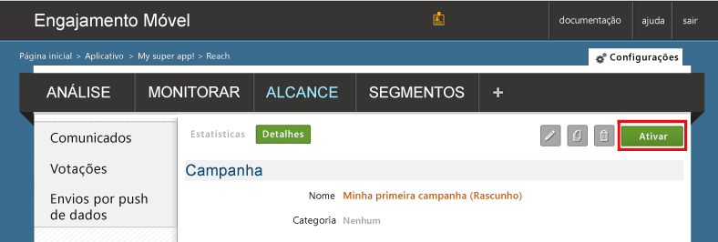

Agora criaremos uma campanha simples de notificação por push que enviará uma notificação por push para nosso aplicativo.

1. Navegue até a guia **REACH** em seu portal do Mobile Engagement
2. Clique em **Novo anúncio** para criar sua campanha de notificação por push.
   
    
3. Configure o primeiro campo da campanha executando as seguintes etapas:
   
    
   
    a. Forneça um **Nome** para sua campanha.
   
    b. Selecione o **Horário de entrega** como *A qualquer momento*.
   
    d. No texto de notificação - digite o **Título** que estará em negrito no envio por push.
   
    e. Em seguida, digite sua **Mensagem**
4. Role para baixo e, na seção **Conteúdo**, selecione **Somente notificação**.
   
    
5. Você concluiu a configuração da campanha mais básica possível. Agora role para baixo novamente e clique no botão **Criar** para salvar sua campanha.
6. Última etapa: clique em **Ativar** para ativar sua campanha e enviar notificações por push.
   
    

<!--HONumber=Nov16_HO2-->

