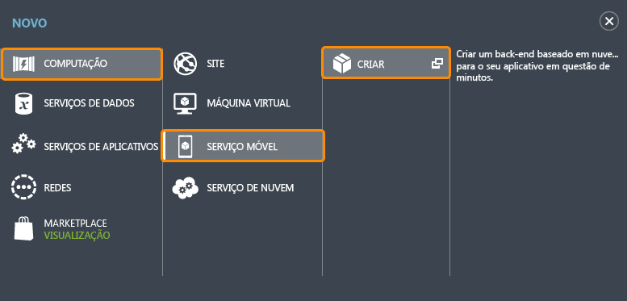
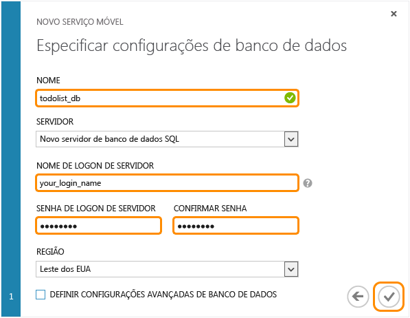



Siga estas etapas para criar um novo serviço móvel.

1.	Faça logon no [Portal de Gerenciamento]. Na parte inferior do painel de navegação, clique em **+NOVO**. Expanda **Computação** e **Serviço Móvel** e, em seguida, clique em **Criar**.

	

	Isso exibe a caixa de diálogo **Criar um serviço móvel**.

2.	Na caixa de diálogo **Criar um serviço móvel**, selecione **Criar um banco de dados SQL gratuito com 20 MB**, selecione o tempo de execução do **JavaScript** e, em seguida, digite um nome de subdomínio para o novo serviço móvel na caixa de texto **URL**. Clique no botão de seta para a direita para ir para a próxima página.

	

	Isso exibe a página **Especificar configurações de banco de dados**.
	>[AZURE.NOTE]Como parte deste tutorial, você criará um novo servidor e uma nova instância do Banco de Dados SQL. Você pode reutilizar este novo banco de dados e administrá-lo como faria com qualquer outra instância do Banco de Dados SQL. Se você já tiver um banco de dados na mesma região como novo serviço móvel, você poderá escolher **Usar o banco de dados existente** e, em seguida, selecionar esse banco de dados. O uso de um banco de dados em uma região diferente não é recomendado devido a latências maiores e aos custos adicionais de largura de banda.

3.	Em **Nome**, digite o nome do novo banco de dados, digite **Nome de logon**, que é o nome de logon de administrator do novo servidor de Banco de Dados SQL, digite e confirme a senha e clique no botão de seleção para concluir o processo.
	

Você criou um novo serviço móvel que pode ser usado por seus aplicativos móveis.

<!-- URLs. -->
[Portal de Gerenciamento]: https://manage.windowsazure.com/

<!--HONumber=52--> 
