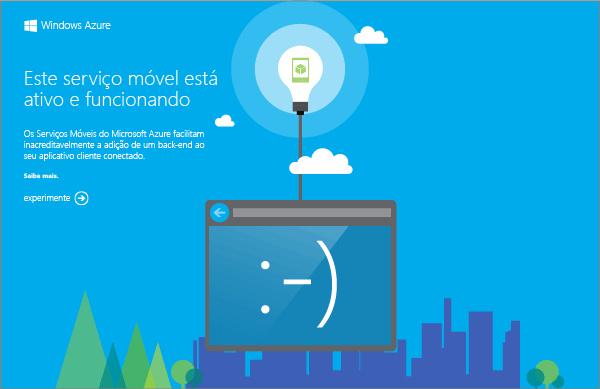

O projeto de serviço móvel que você baixa permite executar seu serviço móvel no computador local ou na máquina virtual. Isso facilita a depuração do código do serviço antes mesmo de você publicá-lo no Azure.

Nesta seção, você testará seu novo aplicativo no serviço móvel em execução localmente.

1. Navegue até o local onde você salvou os arquivos compactados do projeto, expanda os arquivos em seu computador e abra o arquivo da solução no Visual Studio.

2. Pressione a tecla **F5** para recompilar o projeto e iniciar o serviço móvel localmente.

	

	Uma página da Web é exibida depois que o serviço móvel é iniciado com êxito.

3. No Gerenciador de Soluções do Visual Studio, clique com o botão direito do mouse em seu projeto de aplicativo cliente e clique em **Definir como Projeto de Inicialização** e, em seguida, pressione a chave **F5** para recompilar o projeto e iniciar o aplicativo.

	Isso inicia o aplicativo que se conecta à instância local do serviço móvel.

4. No aplicativo, digite um texto com sentido, como _Concluir o tutorial_, em **Inserir um TodoItem** e clique em **Salvar**.

	Isso envia uma solicitação POST ao serviço móvel local. Os dados da solicitação são inseridos na tabela TodoItem. Os itens armazenados na tabela são retornados pelo serviço móvel, e os dados são exibidos na segunda coluna do aplicativo.

<!---HONumber=July15_HO1-->