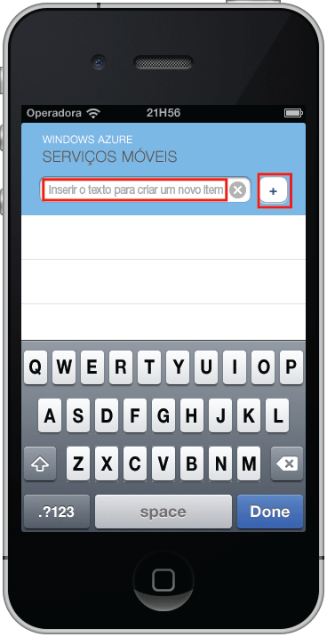



O estágio final deste tutorial é compilar e executar seu novo aplicativo.

1. Navegue até o local onde você salvou os arquivos compactados do projeto, expanda os arquivos em seu computador e abra o arquivo do projeto usando o Xcode.

2. Pressione o botão **Executar** para criar o projeto e iniciar o aplicativo no emulador do iPhone.

3. No aplicativo, digite um texto significativo, como _Concluir o tutorial_, e clique no ícone de adição (**+**).

   	

   	Isso envia uma solicitação de POST para o novo serviço móvel hospedado no Azure. Os dados da solicitação são inseridos na tabela TodoItem. Os itens armazenados na tabela são retornados pelo serviço móvel, e os dados são exibidos na lista.

 	

<!--HONumber=52--> 
