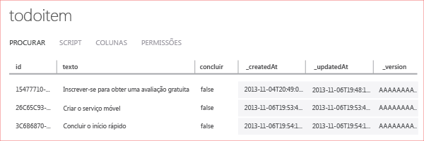


O estágio final deste tutorial é compilar e executar seu novo aplicativo.

1. Navegue até o local onde você salvou os arquivos compactados do projeto, expanda os arquivos em seu computador e abra o arquivo da solução no Visual Studio.

2. Pressione a tecla **F5** para recompilar o projeto e iniciar o aplicativo.

3. No aplicativo, digite um texto significativo, como *Concluir o tutorial*, em **Inserir um TodoItem** e clique em **Salvar**.

   	Isso envia uma solicitação de POST ao novo serviço móvel hospedado no Azure. Os dados da solicitação são inseridos na tabela TodoItem. Os itens armazenados na tabela são retornados pelo serviço móvel, e os dados são exibidos na segunda coluna do aplicativo.

4. (Opcional) Em uma solução universal do Windows, altere o projeto inicial padrão para o outro aplicativo e execute o aplicativo novamente.

	Observe que os dados salvos da etapa anterior são carregados a partir do serviço móvel após o aplicativo ser iniciado.
 
4. No Portal de Gerenciamento, clique na guia **Dados** e, em seguida na tabela **TodoItems**.

   	

   	Isso permite que você procure os dados inseridos pelo aplicativo na tabela.

   	

<!--HONumber=42-->
