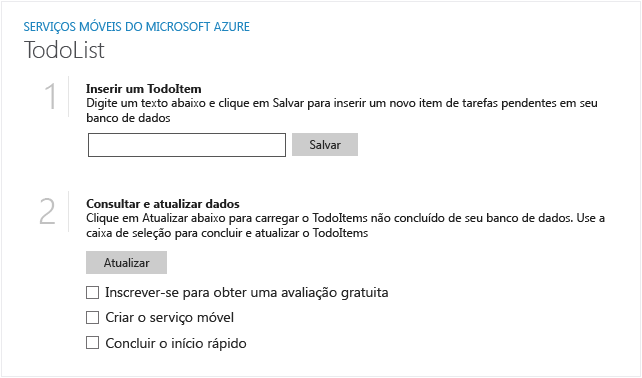
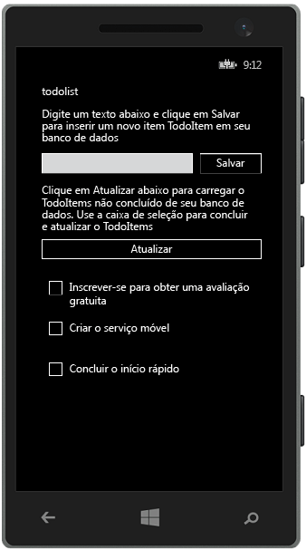


A seguir, há capturas de tela do aplicativo concluído:

 Aplicativo da Windows Store

  Aplicativo da Loja do Windows Phone

A conclusão deste tutorial é um pré-requisito para todos os outros tutoriais de Serviços Móveis para aplicativos da Windows Store e da Loja do Windows Phone. 
<!--HONumber=42-->
