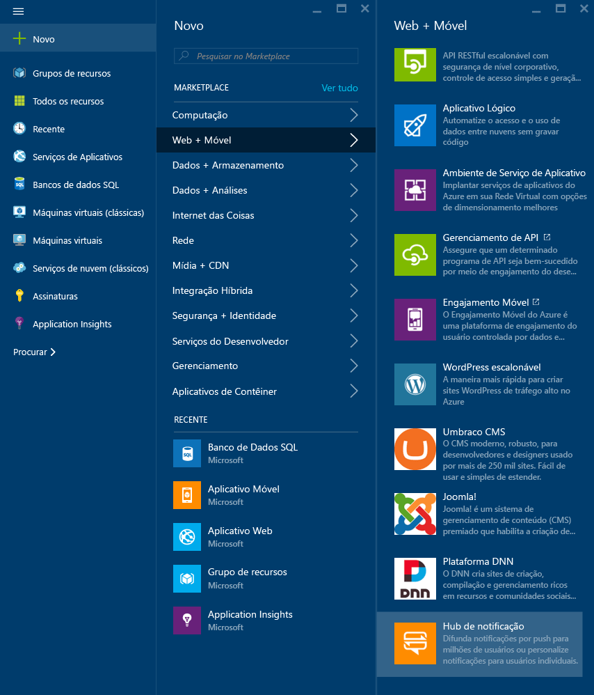
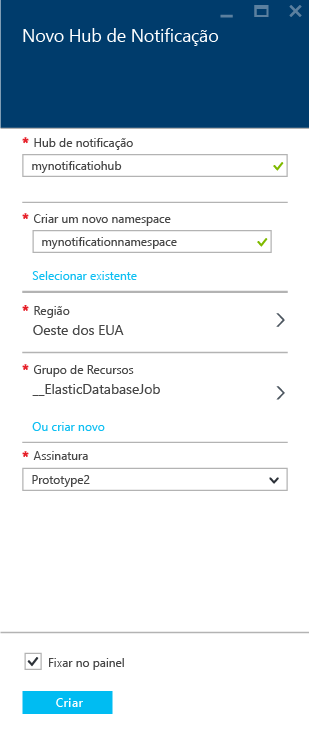
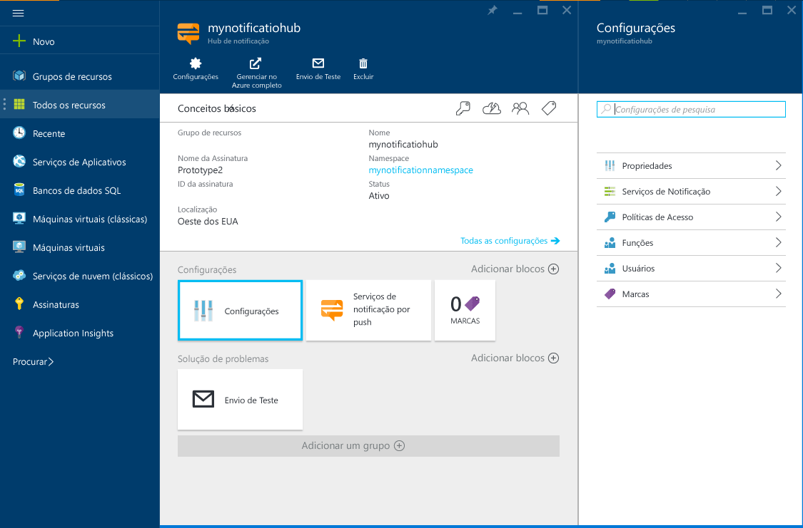
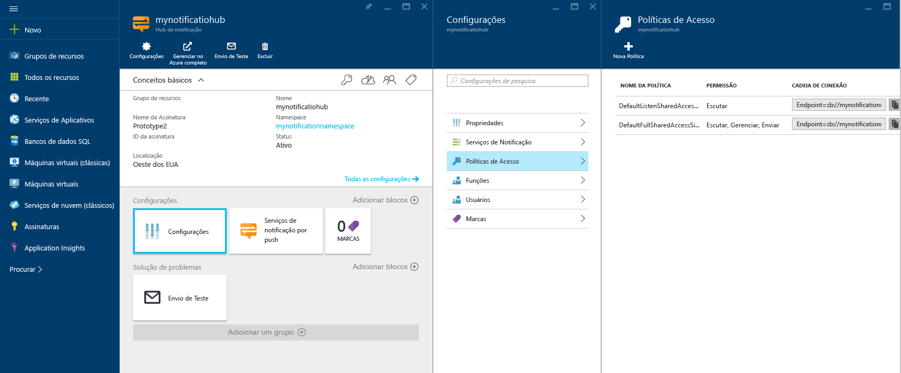

1. Faça logon no [Portal do Azure](https://portal.azure.com) e clique em **+NOVO** na parte superior esquerda da tela.
2. Clique em **Novo** e em **Web + Móvel**. Role para baixo, se for necessário, e clique em **Hub de Notificação**.
   
       
3. Especifique um nome exclusivo no campo **Hub de Notificação**. Selecione a **Região** desejada, a **Assinatura** e o **Grupo de Recursos** (se você já tiver um).
   
    Se você já tiver um namespace de barramento de serviço no qual deseje criar o hub, selecione-o por meio da opção **Selecionar Existente** no campo **Namespace**. Caso contrário, você poderá usar o nome padrão que será criado com base no nome do hub, desde que o nome do namespace esteja disponível.
   
    Quando estiver pronto, clique em **Criar**.
   
       
4. Depois que o namespace e o hub de notificação forem criados, você será levado para a respectiva página do portal.
   
       
5. Clique em **Configurações** e em **Políticas de Acesso** - anote as duas cadeias de conexão disponibilizadas, pois você precisará delas para lidar com notificações por push mais tarde.
   
       

<!---HONumber=AcomDC_0413_2016-->