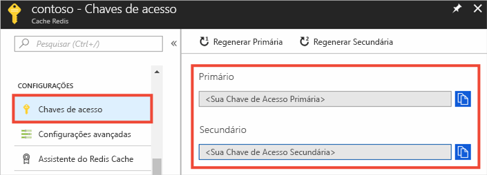
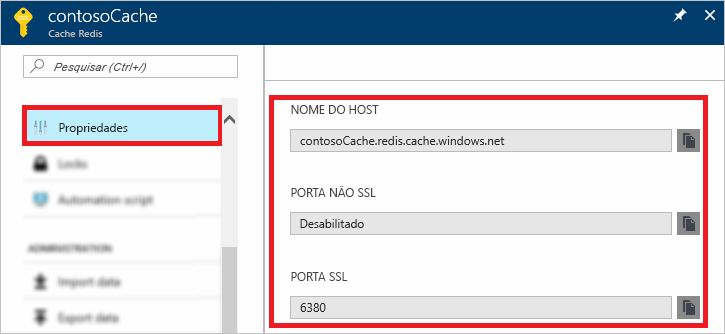

### Recuperar o nome de host, portas e chaves de acesso usando o Portal do Azure

Ao se conectar a uma instância do Cache Redis do Azure, os clientes de cache precisam do nome de host, das portas e uma chave para o cache. Alguns clientes podem se referir a esses itens por nomes um pouco diferentes. Você pode recuperar essas informações no portal do Azure.

Para recuperar as chaves de acesso usando o [portal do Azure](https://portal.azure.com), navegue até seu cache e clique em **Chaves de acesso**. 

Para recuperar o nome de host, portas, clique em **Propriedades**.

