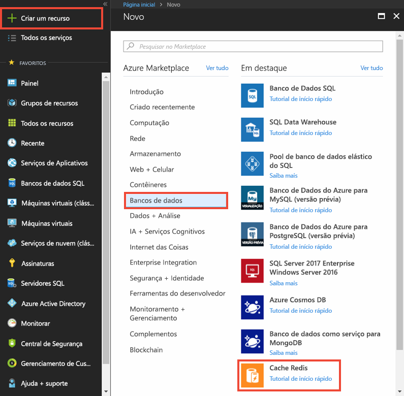
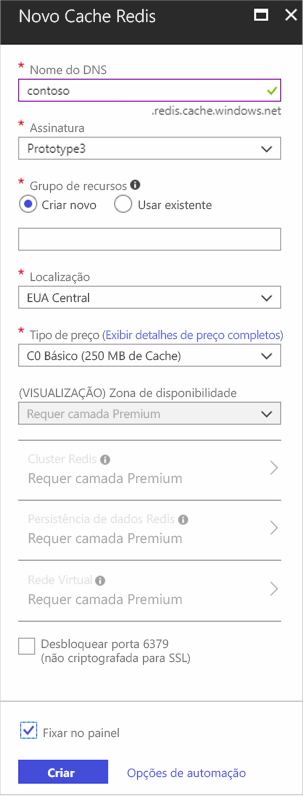
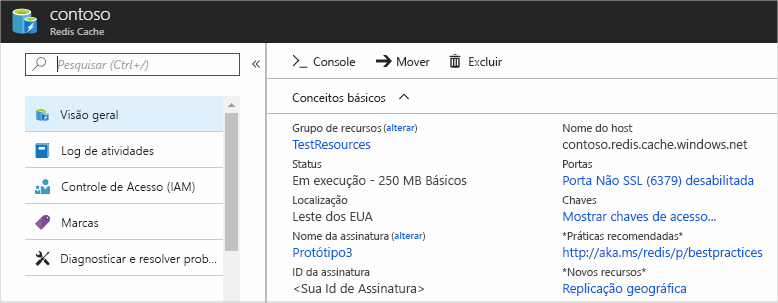

Para criar um cache, primeiro entre no [portal do Azure](https://portal.azure.com) e clique em **Novo**, **Dados + Armazenamento** e **Cache Redis**.

> [!NOTE]
> Se você não tiver uma conta do Azure, poderá [Abrir uma conta do Azure gratuitamente](https://azure.microsoft.com/pricing/free-trial/?WT.mc_id=redis_cache_hero) em poucos minutos.
> 
> 

> [!NOTE]
> Além de criar caches no portal do Azure, você também pode criá-los usando os modelos do Resource Manager, PowerShell ou CLI do Azure.
> 
> * Para criar um cache usando os modelos Resource Manager, consulte [Criar um cache Redis usando um modelo](../articles/redis-cache/cache-redis-cache-arm-provision.md).
> * Para criar um cache usando o Azure PowerShell, consulte [Gerenciar Cache Redis do Azure com o Azure PowerShell](../articles/redis-cache/cache-howto-manage-redis-cache-powershell.md).
> * Para criar um cache usando a CLI do Azure, consulte [Como criar e gerenciar o Cache Redis do Azure usando a Interface de linha de comando do Azure (Azure CLI)](../articles/redis-cache/cache-manage-cli.md).
> 
> 

Na folha **Novo Cache Redis** , especifique a configuração desejada para o cache.

 

* No **nome DNS**, insira um nome de cache a ser usado para o ponto de extremidade do cache. O nome de cache deve ser uma cadeia de caracteres com 1 a 63 caracteres e deve conter somente números, letras e o caractere `-` . O nome de cache não pode começar nem terminar com o caractere `-` e os caracteres `-` consecutivos não são válidos.
* Para **Assinatura**, selecione a assinatura do Azure que você deseja usar para o cache. Se sua conta tiver apenas uma assinatura, ela será automaticamente selecionada e o menu suspenso **Assinatura** não será exibido.
* No **Grupo de recursos**, selecione ou crie um grupo de recursos para seu cache. Para obter mais informações, consulte [Usando os grupos de recursos para gerenciar seus recursos do Azure](../articles/azure-resource-manager/resource-group-overview.md). 
* Use **Local** para especificar a localização geográfica em que o cache está hospedado. Para obter melhor desempenho, a Microsoft recomenda que você crie o cache na mesma região que o aplicativo de cliente de cache.
* Utilize **Faixa de preço** para selecionar o tamanho e recursos de cache desejados.
* **cluster Redis** permite criar caches com mais de 53 GB e fragmentar dados em vários nós Redis. Para saber mais, consulte [Como configurar um cluster para um Cache Redis do Azure Premium](../articles/redis-cache/cache-how-to-premium-clustering.md).
* **persistência Redis** oferece a capacidade de persistir o cache para uma conta de Armazenamento do Azure. Para obter instruções sobre como configurar a persistência, consulte [Como configurar a persistência para um Cache Redis do Azure Premium](../articles/redis-cache/cache-how-to-premium-persistence.md).
* **Rede Virtual** provides enhanced security and isolation by restricting access to your cache to only those clients within the specified Azure Rede Virtual. Você pode usar todos os recursos da VNet como sub-redes, políticas de controle de acesso e outros recursos para restringir ainda mais o acesso ao Redis. Para saber mais,confira [Como configurar o suporte de Rede Virtual para um Cache Redis do Azure Premium](../articles/redis-cache/cache-how-to-premium-vnet.md).

Uma vez que as novas opções de cache forem configuradas, clique em **Criar**. Pode levar alguns minutos para que o cache seja criado. Para verificar o status, você pode monitorar o progresso na Startboard. Depois do cache ter sido criado, seu novo cache terá um status **Executando** e estará pronto para o uso com as [configurações padrão](../articles/redis-cache/cache-configure.md#default-redis-server-configuration).

<!--HONumber=Jan17_HO1-->

