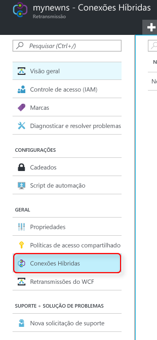
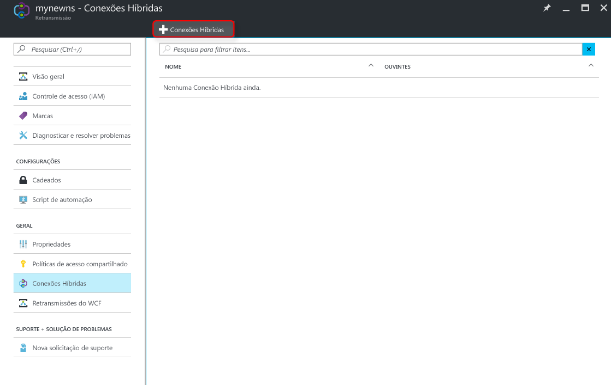
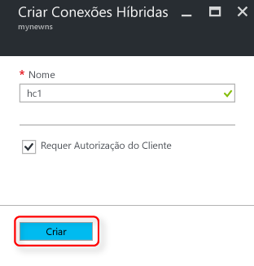

Verifique se você já [criou um namespace Retransmissão][namespace-how-to].

1. Entre no [Portal do Azure](https://portal.azure.com).
2. No menu do lado esquerdo, selecione **Todos os recursos**.
3. Selecione o namespace no qual você gostaria de criar a conexão híbrida. Nesse caso, é **mynewns**.  
4. Em **Namespace de Retransmissão**, selecione **Conexões Híbridas**.

    

5. Na janela de visão geral do namespace, selecione **+ Conexão Híbrida**
   
    
6. Em **Criar Conexão Híbrida**, insira um valor para o nome da conexão híbrida. Deixe os outros valores padrão.
   
    
7. Selecione **Criar**.

[namespace-how-to]: ../articles/service-bus-relay/relay-create-namespace-portal.md 