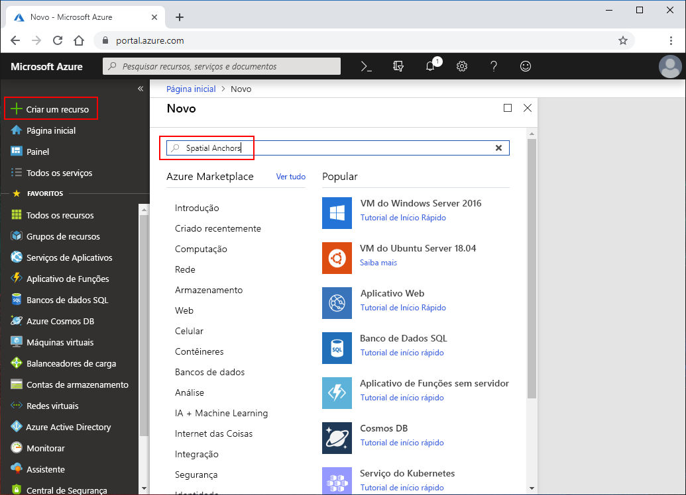
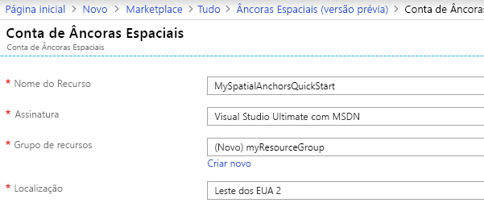
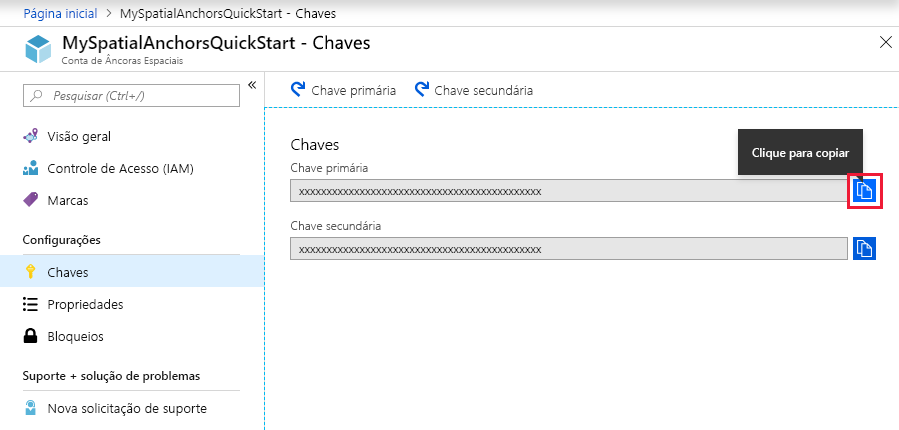

## Criar um recurso Âncoras Espaciais

Vá para o <a href="https://portal.azure.com" target="_blank">Portal do Azure</a>.

No painel de navegação esquerdo do portal do Azure, clique em **Criar um recurso**.

Use a caixa de pesquisa para **Âncoras Espaciais**.

   

Selecione **Âncoras Espaciais**. Na caixa de diálogo, selecione **Criar**.

No caixa de diálogo **Conta de Âncoras Espaciais**:

- Insira um nome de recurso exclusivos, usando caracteres alfanuméricos regulares.
- Selecione a assinatura que você deseja anexar o recurso.
- Crie um grupo de recursos, selecionando **Criar novo**. Denomine-o como **myResourceGroup** e selecione **OK**.
      [!INCLUDE [resource group intro text](resource-group.md)]
- Selecione um local (região) para criar o recurso.
- Selecione **Novo** para começar a criar o recurso.

   

Depois que o recurso é criado, o portal do Azure mostra que a implantação foi concluída. Clique em **Ir para o recurso**.

Em seguida, você pode exibir as propriedades do recurso. Copiar o valor de **ID da conta** em um editor de texto, pois você precisará dele mais tarde.

   

Em **Configurações**, selecione **Chave**. Cópia do valor de **Chave primária** em um editor de texto. Esse valor é o `Account Key`. Você precisará dela mais tarde.

   
