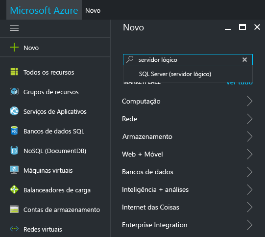
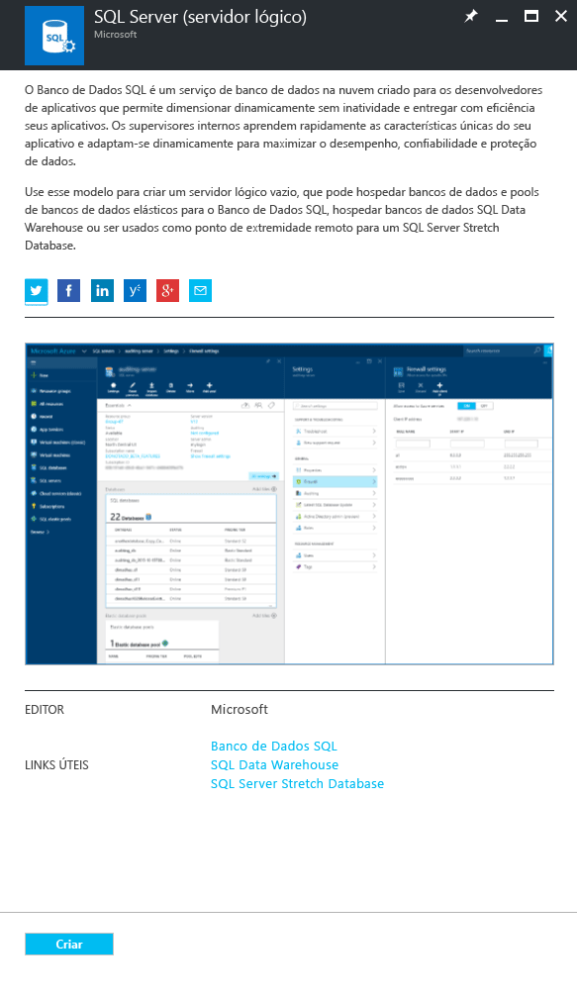
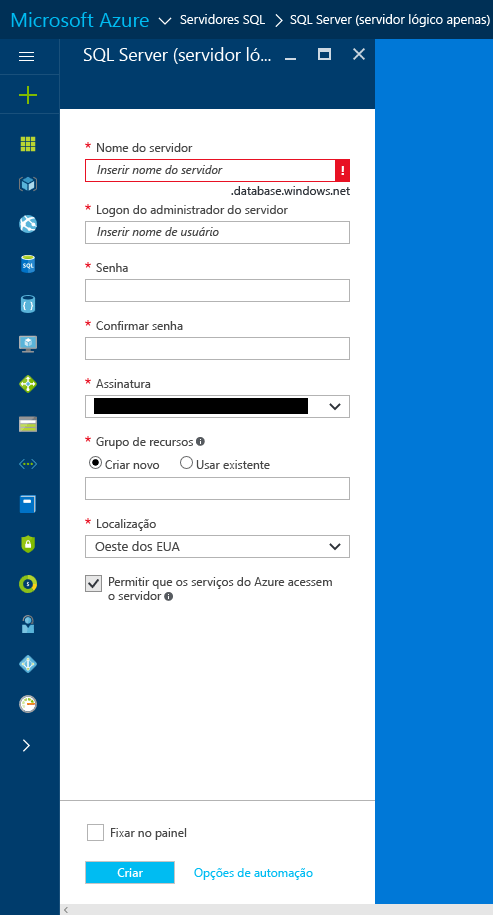
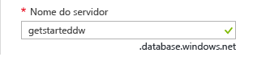
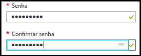
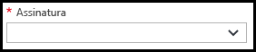
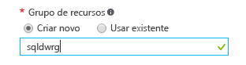
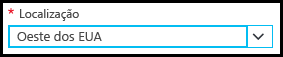

### Criar um novo servidor lógico do SQL no portal do Azure

1. Clique em **Novo**, pesquise **servidor lógico** e pressione **ENTER**.

    
2. Selecione **SQL server (servidor lógico)** 

    
  
3. Clique em **Criar** para abrir a nova folha do SQL Server (servidor lógico).

   <kbd>  </kbd>
    <kbd> </kbd>
  
3. Na caixa de texto do nome do servidor da folha SQL Server (servidor lógico), forneça um nome válido para o novo servidor lógico. Uma marca de seleção verde indica que você forneceu um nome válido.
    
    

    > [!IMPORTANT]
    > O nome totalmente qualificado para o novo servidor será <nome_do_servidor>.database.windows.net.
    >
    
4. Na caixa de texto de logon do administrador de servidor, forneça um nome de usuário para o logon de autenticação do SQL para este servidor. Esse logon é conhecido como o logon principal do servidor. Uma marca de seleção verde indica que você forneceu um nome válido.
    
    
5. Nas caixas de texto **Senha** e **Confirmar senha**, forneça uma senha para a conta de logon da entidade de segurança. Uma marca de seleção verde indica que você forneceu uma senha válida.
    
    
6. Selecione uma assinatura em que você tenha permissão para criar objetos.

    
7. Na caixa de texto Grupo de recursos, selecione **Criar novo** e, na caixa de texto grupo de recursos, forneça um nome válido para o novo grupo de recursos (você também pode usar um grupo de recursos existente, caso já tenha criado um). Uma marca de seleção verde indica que você forneceu um nome válido.

    

8. Na caixa de texto **Local**, selecione um data center apropriado para seu local, como "Leste da Austrália".
    
    
    
    > [!TIP]
    > A caixa de seleção para **Permitir que os serviços do Azure acessem o servidor** não pode ser alterado nessa folha. Você pode alterar essa configuração na folha de firewall do servidor. Para obter mais informações, confira [Introdução à segurança](../articles/sql-database/sql-database-manage-servers-portal.md).
    >
    
9. Clique em **Criar**.

    

