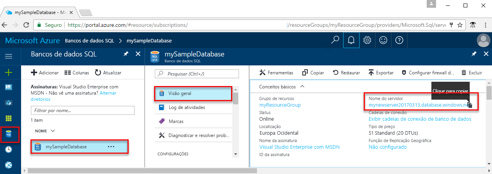

<!-- sql-database-connect-query-prerequisites-server-connection-info-includes.md 

## SQL server connection information
-->

Obtenha as informações de conexão necessárias para se conectar ao Banco de Dados SQL do Azure. Você precisará do nome totalmente qualificado do servidor, nome do banco de dados e informações de logon nos próximos procedimentos.

1. Faça logon no [Portal do Azure](https://portal.azure.com/).
2. Selecione **Bancos de Dados SQL** no menu à esquerda e clique em seu banco de dados na página **Bancos de Dados SQL**. 
3. Na página **Visão geral** do banco de dados, examine o nome totalmente qualificado do servidor, como mostrado na imagem a seguir. Você pode passar o mouse sobre o nome do servidor para abrir a opção **Clique para copiar**.  

    

4. Se você esquecer as suas informações de logon do servidor, navegue até a página do servidor do Banco de Dados SQL para exibir o nome de administrador do servidor. Se necessário, redefina a senha.

