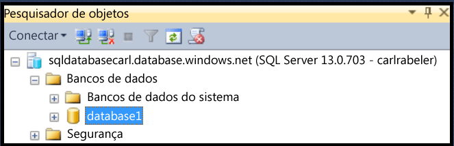
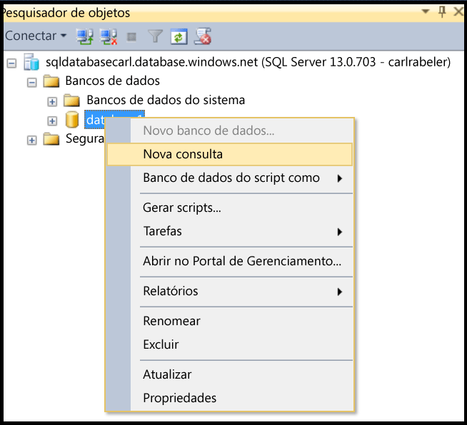

## <a name="create-new-database-user-using-ssms"></a>Criar um novo usuário de banco de dados usando SSMS
Use as etapas a seguir para criar um novo usuário de banco de dados em um banco de dados existente usando o SSMS. 

Essas etapas pressupõem que você esteja conectado ao Banco de Dados SQL no Pesquisador de Objetos usando SSMS e conectado ao seu servidor lógico do Banco de Dados SQL como um administrador de entidade no nível do servidor ou com uma conta de usuário com permissões para criar um novo usuário. 

1. No Pesquisador de Objetos, expanda o nó Bancos de Dados e selecione o banco de dados no qual você deseja criar uma nova conta de usuário.
   
     
2. Clique com o botão direito do mouse no banco de dados selecionado e clique em **Consultar**.
   
     
3. Na janela da consulta, edite e use a seguinte instrução Transact-SQL para criar um usuário independente no banco de dados do usuário. 
   
    ```CREATE USER user1 WITH PASSWORD ='p@ssw0rd1';
    ```
   
     


<!--HONumber=Nov16_HO2-->


