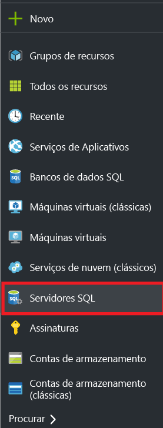
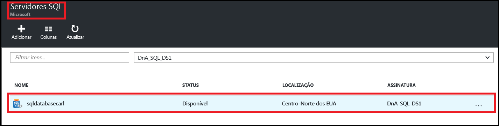
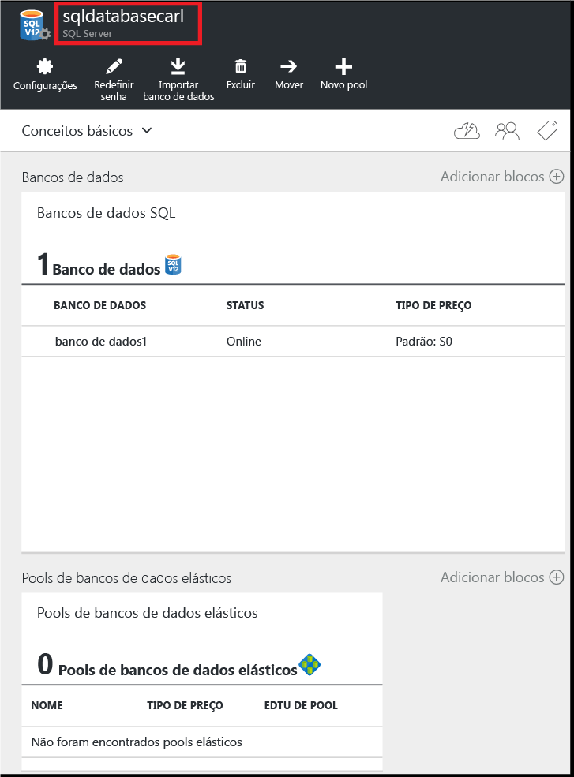
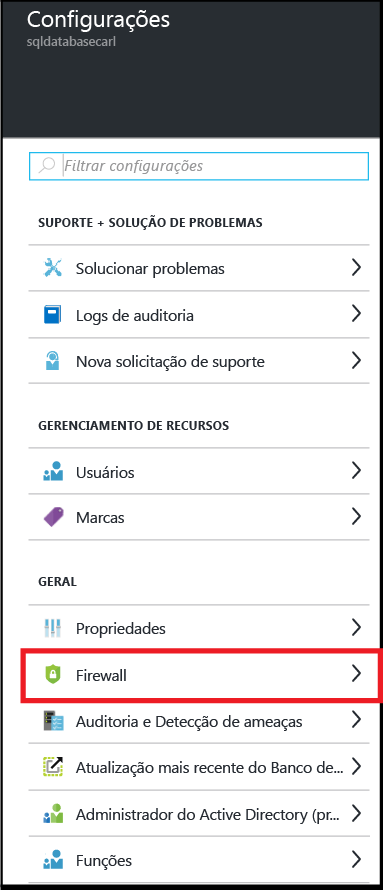
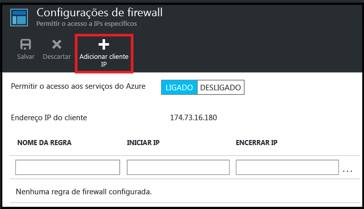
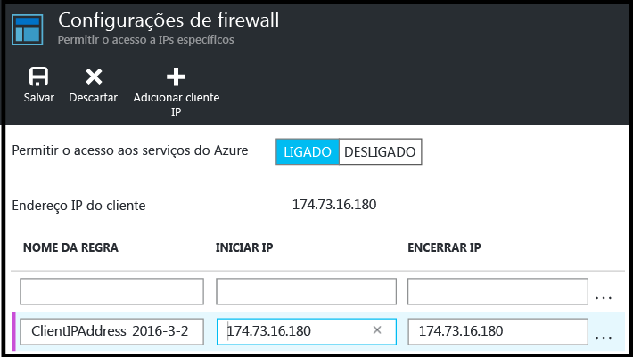
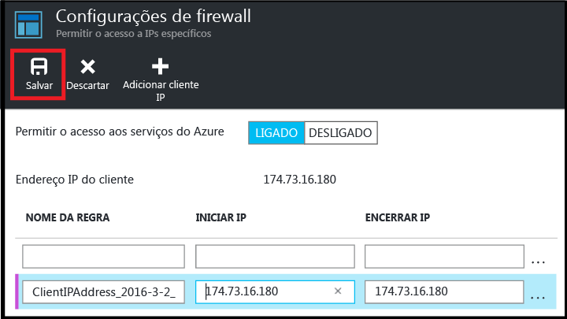

<!--
includes/sql-database-create-new-server-firewall-portal.md

Latest Freshness check:  2016-08-01 , rickbyh.

As of circa 2016-04-11, the following topics might include this include:
articles/sql-database/sql-database-get-started-tutorial.md
articles/sql-database/sql-database-configure-firewall-settings

-->
## Criar um novo firewall de nível de servidor do SQL do Azure

Use as seguintes etapas no portal do Azure para criar uma regra de firewall de nível de servidor que permite conexões de um endereço IP individual (seu computador cliente) ou um intervalo inteiro de endereços IP para um servidor lógico do Banco de Dados SQL.

1. Se você não estiver conectado, conecte-se ao [Portal do Azure](http://portal.azure.com).
2. Na folha padrão, clique em **SQL Servers**.

  	

3. Na folha **SQL Servers**, clique no servidor no qual a regra de firewall deve ser criada.

 	

4. Analise as propriedades do servidor.

 	

5. Na folha **Configurações**, clique em **Firewall**.

 	

 	> [AZURE.NOTE] Você também pode acessar a folha **Configurações do firewall** no nível do servidor na barra de ferramentas da folha **Banco de Dados**.

6. Clique em **Adicionar IP do cliente** para que o Azure crie uma regra para o endereço IP do cliente.

      

7. Opcionalmente, clique no endereço IP que foi adicionado para editar o endereço do firewall a fim de permitir o acesso a um intervalo de endereços IP.

      

8. Clique em **Salvar** para criar a regra de firewall no nível do servidor.

     

	>[AZURE.IMPORTANT] Seu endereço IP de cliente pode mudar periodicamente, e talvez você não possa acessar seu servidor até que crie uma nova regra de firewall. Verifique seu endereço IP usando o [Bing](http://www.bing.com/search?q=my%20ip%20address). Depois, adicione um único endereço IP ou um intervalo de endereços IP. Consulte [Gerenciar configurações de firewall](sql-database-configure-firewall-settings.md#manage-existing-server-level-firewall-rules-through-the-azure-portal) para obter detalhes.

<!---HONumber=AcomDC_0912_2016-->