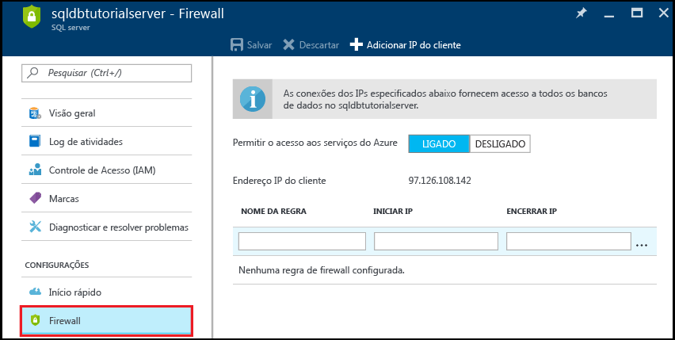
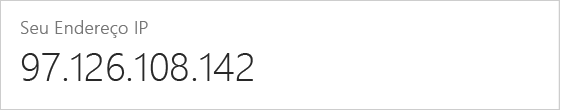
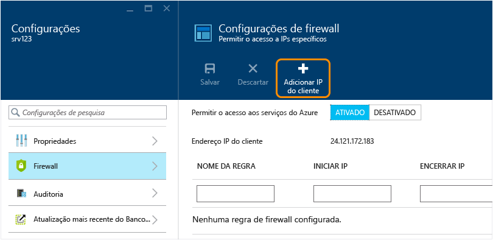

<!--
includes/sql-database-create-new-server-firewall-portal.md

Latest Freshness check:  2016-11-28 , rickbyh.

As of circa 2016-04-11, the following topics might include this include:
articles/sql-database/sql-database-get-started.md
articles/sql-database/sql-database-configure-firewall-settings
articles/sql-data-warehouse-get-started-provision.md

-->
### Criar uma regra de firewall de nível de servidor no portal do Azure

1. Na folha do SQL server, em Configurações, clique em **Firewall** para abrir a folha de Firewall para o SQL server.

    <!--  -->

2. Examine o endereço IP do cliente exibido e confirme se esse é o endereço IP na Internet usando um navegador de sua escolha (perguntar "o que é meu endereço IP). Ocasionalmente, eles não coincidem por vários motivos.

    <!--  -->

3. Supondo que os endereços IP têm correspondência, clique em **Adicionar IP do cliente** na barra de ferramentas.

    

    > [!NOTE]
    > Você pode abrir o firewall do Banco de dados SQL no servidor para um único endereço IP ou um intervalo inteiro de endereços. Abrir o firewall permite que os administradores do SQL e os usuários façam logon em qualquer banco de dados no servidor ao qual eles têm credenciais válidas.
    >

4. Clique em **Salvar** na barra de ferramentas para salvar essa regra de firewall de nível de servidor e, em seguida, clique em **OK**.

    

> [!Tip]
> Para obter um tutorial, confira [Tutorial do banco de dados SQL: criar um servidor, uma regra de firewall de nível de servidor, um banco de dados de exemplo, uma regra de firewall de nível de banco de dados e conectar-se com o SQL Server](../articles/sql-database/sql-database-get-started.md).    
>
