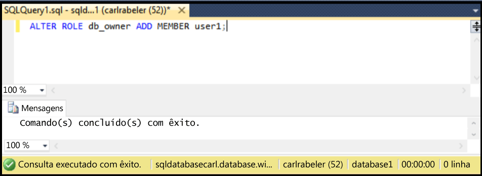

## Conceder permissões de db\_owner a um novo usuário de banco de dados

Use as etapas a seguir para conceder permissões de db\_owner a um usuário de banco de dados existente

As etapas a seguir pressupõem que você esteja usando o SSMS e esteja conectado ao Banco de Dados SQL no Pesquisador de Objetos, esteja conectado ao seu servidor lógico do Banco de Dados SQL como um administrador de entidade no nível do servidor ou com uma conta de usuário com permissões para conceder permissões de usuário.

1. No Pesquisador de Objetos, expanda o nó Bancos de Dados e selecione o banco de dados com o usuário ao qual você deseja atribuir permissões de dbo.

     

2. Clique com o botão direito do mouse no banco de dados selecionado e clique em **Consultar**.

     

3. Na janela da consulta, edite e use a seguinte instrução Transact-SQL para conceder permissões de dbo a um usuário específico.

    ```ALTER ROLE db_owner ADD MEMBER user1;
    ```

     

<!---HONumber=AcomDC_0629_2016-->